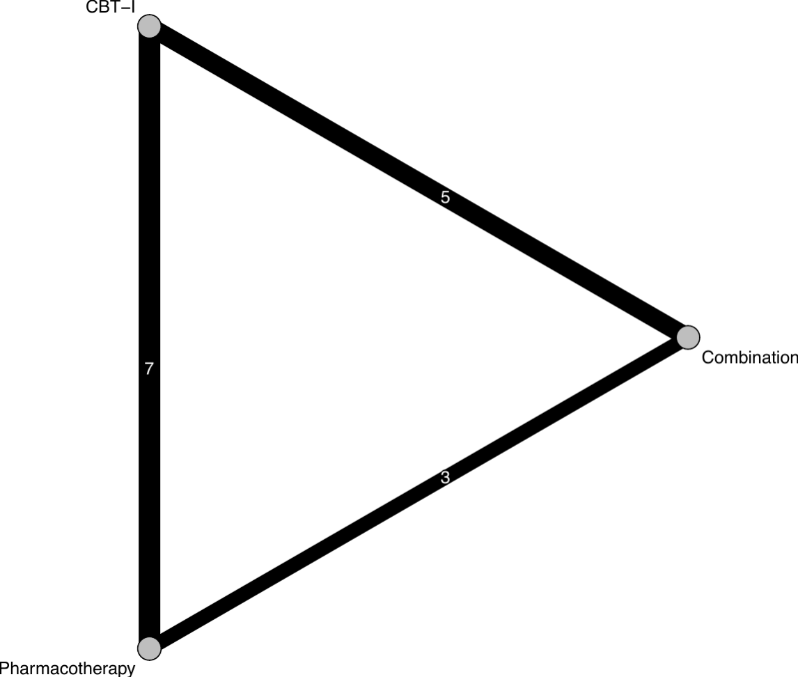
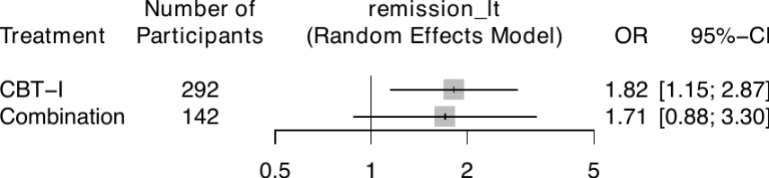

[Manual home](README.md) › Installation and quick start

# Installation and Quick Start

This chapter explains how to install **nmatools**, verify that the installation
succeeded, and run a complete network meta-analysis (NMA) in about five minutes
using the bundled sample data.

## Requirements

- **R ≥ 4.1.** The package uses the native pipe (`|>`) and other features
  introduced in R 4.1, so an older R will not load it.
- **netmeta ≥ 3.x.** The analysis engine is the `netmeta` package; nmatools is
  a set of one-stop wrappers around it. A recent `netmeta` is required because
  the pipeline relies on the modern `common =` / `random =` argument names
  rather than the deprecated `fixed =`.
- **Supporting R packages.** `meta`, `dplyr`, `writexl`, `magick`, `purrr`,
  `tibble`, and `metafor` are installed automatically as dependencies.
- **System dependency for `magick`.** Output PDFs are automatically trimmed of
  surrounding whitespace through the `magick` package, which depends on the
  ImageMagick system library. On most platforms the R package installer pulls a
  bundled ImageMagick, but on some Linux distributions you may need to install
  the system `libmagick` development headers first (for example
  `libmagick++-dev` on Debian/Ubuntu). If `magick` is unavailable, trimming can
  be disabled per call with `trim = FALSE`.

## Install from GitHub

nmatools is distributed from GitHub. Install it with the `remotes` package:

```r
# install.packages("remotes")   # if not already installed
remotes::install_github("ykfrkw/nmatools")
```

All required dependencies (`netmeta`, `meta`, `dplyr`, `writexl`, `magick`, and
the rest) are resolved and installed automatically.

## Verify the installation

Load the package and read the bundled W2I sample data. If the following runs
without error and prints a data frame, the installation is complete:

```r
library(nmatools)

d <- load_w2i()
head(d)
```

The `load_w2i()` helper returns the arm-level `w2i_trials` dataset (Furukawa et
al. 2024): nine insomnia trials comparing three treatments (CBT-I,
Combination, and Pharmacotherapy) across four binary outcomes. Each row is one
treatment arm of one study. The column dictionary is documented in
[Chapter 2](02-data-formats.md).

## Five-minute quick start

A single call to `netmetawrap()` runs the full NMA pipeline for one outcome and
writes every result to disk. Here we analyze long-term remission
(`remission_lt`) on the odds-ratio scale, with Pharmacotherapy as the reference
treatment:

```r
library(nmatools)

d <- load_w2i()

netmetawrap(
  data            = d,
  studlab         = id,              # unquoted column names are accepted
  treat           = t,
  outcome         = "remission_lt",  # also names the output sub-directory
  n               = n,
  event           = r,
  sm              = "OR",
  reference.group = "Pharmacotherapy",
  small.values    = "undesirable"    # fewer remissions is the worse direction
)
# → all results are written to ./outputs/remission_lt/
```

When the call finishes, a new `outputs/remission_lt/` folder appears in your
working directory. It collects the fitted model, the printed summaries, the
consistency tests, a league table, and a set of publication-ready plots. The
full contents of this folder are enumerated in
[Chapter 3](03-nma-pipeline.md); the two headline figures are shown below.


*Network graph of the three-treatment triangle; node size is proportional to
the total number of participants and edge thickness to the number of studies.*


*Random-effects forest plot versus Pharmacotherapy: CBT-I OR 1.82
[1.15; 2.87] and Combination OR 1.71 [0.88; 3.30].*

## Where to go next

- **[Chapter 2 — Data formats](02-data-formats.md):** the arm-based and
  pairwise input formats, the full `w2i_trials` column dictionary, the CINeMA
  CSV export format, and project scaffolding with `create_nma_project()`.
- **[Chapter 3 — The NMA pipeline](03-nma-pipeline.md):** every `netmetawrap()`
  argument, the complete output-file table, customization hooks, and subnetwork
  handling.
- **[Chapter 4 — Batch runs and rare events](04-batch-and-rare-events.md):**
  running many outcomes at once with `run_nma_batch()` and the automatic
  rare-event (Mantel-Haenszel) workflow.
- **[Chapter 5 — Transitivity](05-transitivity.md):** visual assessment of the
  transitivity assumption with `plot_transitivity()`.
- **[Chapter 6 — GUI overview](06-gui-overview.md):** the interactive CINeMA +
  ROB-MEN Shiny application.

---
Prev: [Manual home](README.md) · Next: [Data formats](02-data-formats.md)
