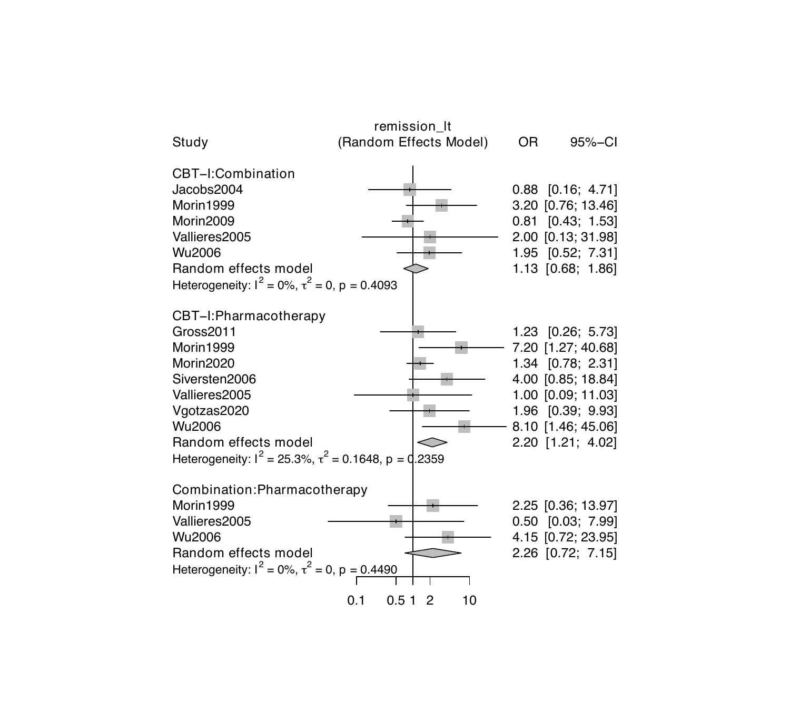
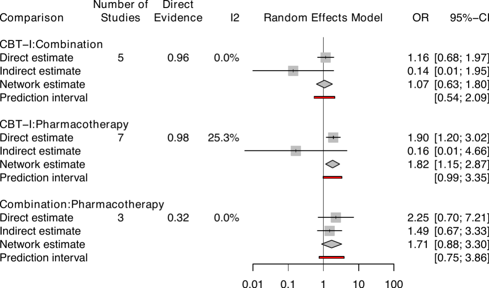
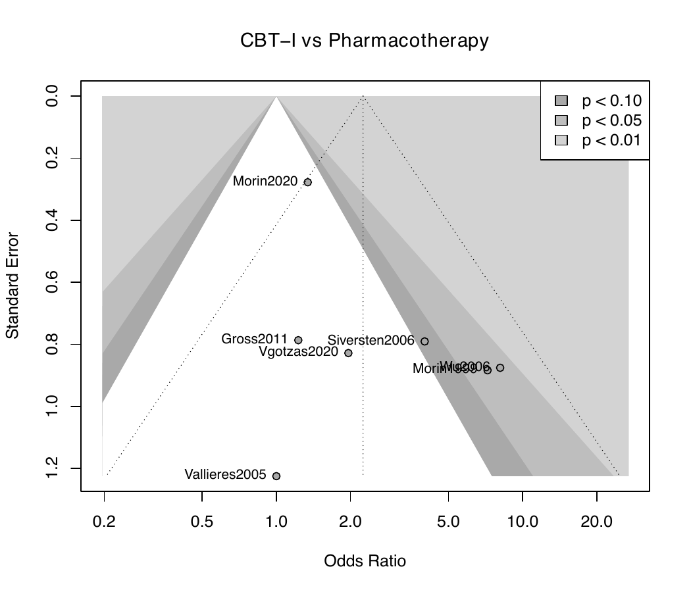
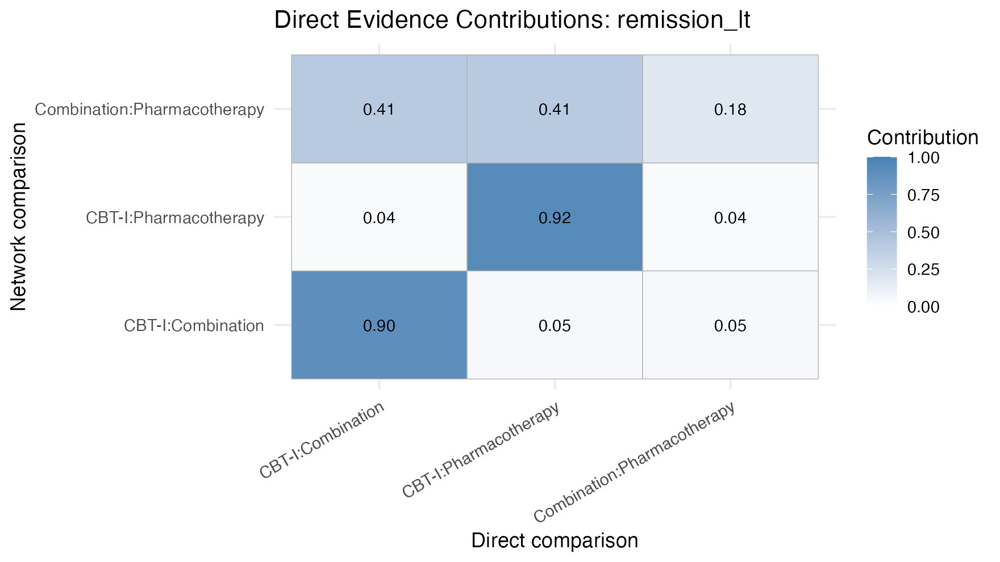
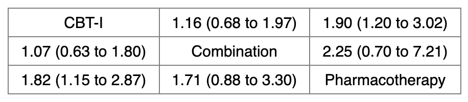
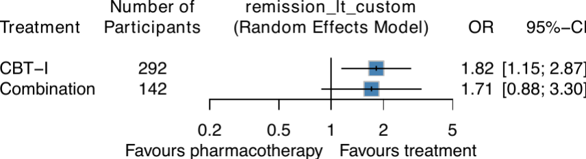

[Manual home](README.md) › The NMA pipeline

# The NMA Pipeline

`netmetawrap()` is the heart of nmatools: a single call that fits a network
meta-analysis for one outcome and writes a complete set of results — the fitted
model, printed summaries, consistency tests, a league table, and a suite of
publication-ready plots — to disk. This chapter dissects every argument group,
lists every output file, shows how to override the defaults, and explains the
automatic behaviors (A4 page splitting, funnel-plot thresholds, and subnetwork
detection).

## Anatomy of `netmetawrap()`

The arguments fall into a few groups. The defaults below are taken directly from
the function signature.

### Data mapping (non-standard evaluation)

`data` is the arm-level data frame. The column-role arguments — `studlab`,
`treat`, `n`, and either `event` (binary) or `mean_col` + `sd_col`
(continuous) — accept **either unquoted column names or strings**. Both of the
following are equivalent:

```r
library(nmatools)
d <- load_w2i()

# unquoted (non-standard evaluation)
netmetawrap(data = d, studlab = id, treat = t, outcome = "remission_lt",
            n = n, event = r, sm = "OR")

# quoted strings
netmetawrap(data = d, studlab = "id", treat = "t", outcome = "remission_lt",
            n = "n", event = "r", sm = "OR")
```

The outcome type is inferred from which columns you map: supplying `event`
selects the **binary** path (`netmeta::netmetabin()`); supplying both
`mean_col` and `sd_col` selects the **continuous** path (`netmeta::netmeta()`).
Supplying neither, or both, raises an error.

### Effect measure and reference

- **`sm`** — the summary measure: `"OR"` or `"RR"` for binary outcomes,
  `"SMD"` or `"MD"` for continuous outcomes.
- **`reference.group`** — the reference treatment as a string. If left `NULL`
  (the default), nmatools auto-selects the treatment with the **largest total
  sample size** across the network and reports its choice in a message.
- **`small.values`** — the direction of benefit: `"undesirable"` (the default;
  smaller values are the worse outcome, e.g. fewer remissions) or `"desirable"`
  (smaller values are the better outcome, e.g. fewer dropouts). This controls
  the P-score ranking and the sort order of the forest plot.

### Output location

- **`outcome`** — a label used to name the output sub-directory and every file
  within it.
- **`path`** — the base output directory (default `"./outputs"`). The function
  creates `{path}/{outcome}/` automatically.

### Override hooks and tuning

- **`netmeta_args`**, **`forest_args`**, **`netpairwise_args`**,
  **`netsplit_args`** — named lists forwarded to the corresponding underlying
  functions, overriding the wrapper's defaults (see
  [Overriding defaults](#overriding-defaults)).
- **`a4_rows_per_page`** — estimated maximum rows per A4 page for large forest
  plots (default `45`).
- **`funnel_min_studies`** — minimum number of studies (k) per pairwise
  comparison required to draw a contour-enhanced funnel plot (default `10`).
- **`rare_events`** — `"auto"` (default), `"always"`, or `"never"`; controls
  the rare-event workflow for binary outcomes, described in
  [Chapter 4](04-batch-and-rare-events.md).
- **`trim`** / **`trim_fuzz`** — whether to trim surrounding whitespace from
  output PDFs with `magick` (default `TRUE`) and the trim fuzz factor
  (default `30`).

## Output files

Running the quick-start call from [Chapter 1](01-installation.md) populates
`outputs/remission_lt/` with the following files. The names all embed the
`outcome` label.

| File | Contents | Figure below |
|------|----------|--------------|
| `data_remission_lt.csv` | Arm-level data actually used | — |
| `netmeta_remission_lt.rds` | Fitted `netmeta` / `netmetabin` object | — |
| `netmeta_remission_lt.txt` | Printed model summary | — |
| `global_test_remission_lt.txt` | `decomp.design()` global inconsistency test | — |
| `local_test_remission_lt.txt` | `netsplit()` local inconsistency (SIDE) test | — |
| `leaguetable_remission_lt.xlsx` | League table | League table |
| `netgraph_remission_lt.pdf` | Network graph | Network graph |
| `forest_remission_lt.pdf` | Forest plot versus reference | Forest |
| `forest_netpairwise_remission_lt.pdf` | All pairwise forest plots | Netpairwise |
| `forest_netsplit_remission_lt.pdf` | Netsplit (direct/indirect) forest | Netsplit |
| `funnel_pairwise_remission_lt_*.pdf` | Contour-enhanced funnel (pairs with k ≥ 10) | Funnel |
| `contributions_remission_lt.pdf` | Direct-evidence contribution heatmap | Contributions |

The following excerpt is the directory listing captured from one real run
(`pipeline_output_tree.txt`):

```
contributions_remission_lt.pdf
data_remission_lt.csv
forest_netsplit_remission_lt.pdf
forest_remission_lt.pdf
global_test_remission_lt.txt
leaguetable_remission_lt.xlsx
local_test_remission_lt.txt
netgraph_remission_lt.pdf
netmeta_remission_lt.rds
netmeta_remission_lt.txt
rare_diagnostics_remission_lt.txt
```

(Under the default `rare_events = "auto"`, a `rare_diagnostics_*.txt` file is
also written; see [Chapter 4](04-batch-and-rare-events.md).)

### The visual outputs


*Network graph: the three-treatment triangle, with node size proportional to
total N and edge thickness to the number of studies.*


*Forest plot versus Pharmacotherapy (random-effects model): CBT-I OR 1.82
[1.15; 2.87], Combination OR 1.71 [0.88; 3.30].*


*Netpairwise forest: every pairwise comparison in the network, pooled across
direct evidence.*


*Netsplit forest: direct, indirect, and network estimates side by side for each
comparison (the SIDE consistency check).*


*Comparison-adjusted, contour-enhanced funnel plot, drawn only for comparisons
with at least `funnel_min_studies` studies.*


*Direct-evidence contribution heatmap: how much each direct comparison
contributes to each network estimate.*


*The league table rendered from the run's `.xlsx`; off-diagonal cells give the
relative effect and confidence interval for each pair.*

### The text outputs

The printed model summary (`netmeta_remission_lt.txt`) reports the treatment
effects, heterogeneity, and the omnibus inconsistency tests:

```
Number of studies: k = 9
Number of pairwise comparisons: m = 15
Number of treatments: n = 3

Random effects model

Treatment estimate (other treatments vs 'Pharmacotherapy'):
                    OR           95%-CI    z p-value
CBT-I           1.8176 [1.1494; 2.8743] 2.56  0.0106
Combination     1.7054 [0.8813; 3.3001] 1.58  0.1130
Pharmacotherapy      .                .    .       .

Quantifying heterogeneity / inconsistency:
tau^2 = 0.0206; tau = 0.1435; I^2 = 4.2% [0.0%; 61.9%]
```

The global inconsistency test (`global_test_remission_lt.txt`) is the
design-based decomposition of the Q statistic:

```
Q statistics to assess homogeneity / consistency

                    Q df p-value
Total           10.44 10  0.4032
Within designs   4.68  8  0.7916
Between designs  5.76  2  0.0561
```

The local inconsistency test (`local_test_remission_lt.txt`) separates indirect
from direct evidence (SIDE) for every comparison:

```
Separate indirect from direct evidence (SIDE) using back-calculation method

Random effects model:

                  comparison k prop    nma direct indir.    RoR    z p-value
           CBT-I:Combination 5 0.96 1.0658 1.1577 0.1385 8.3595 1.54  0.1230
       CBT-I:Pharmacotherapy 7 0.98 1.8176 1.9032 0.1642 11.587 1.42  0.1550
 Combination:Pharmacotherapy 3 0.32 1.7054 2.2528 1.4940 1.5079 0.57  0.5688
```

## Overriding defaults

Every key argument of the underlying `netmeta()`, `forest()`,
`netpairwise()`, and `netsplit()` calls can be overridden through the matching
`*_args` list. Values you supply replace the wrapper's defaults for that call.

```r
library(nmatools)
d <- load_w2i()

netmetawrap(
  data            = d,
  studlab         = id,
  treat           = t,
  outcome         = "remission_lt_custom",
  n               = n,
  event           = r,
  sm              = "OR",
  reference.group = "Pharmacotherapy",
  small.values    = "undesirable",
  netmeta_args     = list(incr = 0.5),   # raise continuity correction from 0.001
  forest_args      = list(leftcols = c("studlab", "n.trts"),
                          xlim     = c(0.1, 10)),
  netpairwise_args = list(prediction = FALSE),
  netsplit_args    = list(prediction = FALSE)
)
```

The forest plot below was produced with `forest_args` overrides (custom `xlim`
and column labels) to illustrate the customization hooks:


*The same forest plot after `forest_args` overrides: a custom x-axis range and
left-column layout.*

## Automatic behaviors

### A4 page splitting

Large forest plots (netpairwise and netsplit outputs) can exceed the height of
a single A4 page. When a plot would need more rows than `a4_rows_per_page`
(default `45`), nmatools splits it across multiple files with `_p1.pdf`,
`_p2.pdf`, and so on, so that every page prints cleanly. Networks that fit on a
single page produce a single, unsuffixed PDF.

### Funnel-plot threshold

Contour-enhanced funnel plots are only informative when a comparison has enough
studies. nmatools draws a `funnel_pairwise_*` plot only for pairwise
comparisons with at least `funnel_min_studies` (default `10`) direct studies.
In the small W2I network no comparison reaches this threshold, so no funnel
plot is written for it; the figure above comes from a larger network.

### Subnetwork auto-detection

Before fitting, `netmetawrap()` calls `netmeta::netconnection()` to check
whether the network is connected. If it detects more than one subnetwork, it
analyzes each subnetwork separately and writes the results into nested
sub-directories:

```
outputs/
└── remission_lt/
    ├── data_remission_lt.csv          ← from the top-level connectivity pass
    ├── remission_lt_subnet_1/
    │   └── ...                         ← full result set for subnetwork 1
    └── remission_lt_subnet_2/
        └── ...                         ← full result set for subnetwork 2
```

Within each subnetwork, the reference treatment is honored if it is present;
otherwise the largest-N treatment in that subnetwork is used. The top-level call
returns `NULL` (invisibly) when subnetworks are detected, because there is no
single network-wide model to return.

## Pitfalls

> **Use `common =`, not `fixed =`.** Recent `netmeta` renamed the common-effect
> (formerly "fixed-effect") switch from `fixed =` to `common =`. If you pass
> overrides through `netmeta_args`, use `common = TRUE`/`FALSE`; the deprecated
> `fixed =` argument will warn or be ignored. This is why nmatools requires a
> reasonably recent `netmeta` (see [Chapter 1](01-installation.md)).

> **`small.values` is about the outcome, not the effect size.** Set it to
> `"undesirable"` when a *smaller* outcome value is *worse* (remission counts),
> and `"desirable"` when a smaller value is *better* (dropout counts). Getting
> this backwards inverts the P-score ranking and the forest sort order without
> raising an error.

---
Prev: [Data formats](02-data-formats.md) · Next: [Batch runs and rare events](04-batch-and-rare-events.md)
