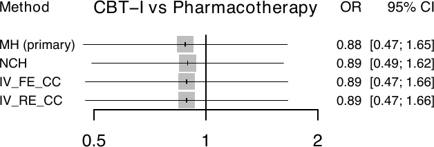

[Manual home](README.md) › Batch runs and rare events

# Batch Runs and Rare Events

Real projects rarely stop at one outcome. `run_nma_batch()` runs the full
`netmetawrap()` pipeline across many outcomes from a single specification, and
the built-in rare-event workflow automatically switches to a Mantel-Haenszel
analysis when the data are sparse. This chapter covers both.

## Batch runs with `run_nma_batch()`

`run_nma_batch(params_list, .default_args)` iterates over a list of per-outcome
parameter sets and calls `netmetawrap()` for each one. The idea is to write down
the shared arguments once, in `.default_args`, and only the differences
per outcome in `params_list`:

- **`.default_args`** — a named list of argument values shared across every
  outcome (for example `data`, `studlab`, `treat`, `reference.group`, `path`).
- **`params_list`** — a list of per-outcome parameter lists. Each element must
  contain at least `outcome`; any key it sets **overrides** the same key in
  `.default_args` for that outcome. Every key must be a valid `netmetawrap()`
  argument name.

Each outcome is run inside a `tryCatch()`, so a failure in one outcome logs an
error message and continues to the next rather than aborting the whole batch.
The fitted objects are returned invisibly as a list.

> **PITFALL — column names must be STRINGS in a batch.** In a direct
> `netmetawrap()` call you may pass column names unquoted (`studlab = id`). In
> `run_nma_batch()` you must quote them (`studlab = "id"`, `event = "r"`). This
> is because the parameters are forwarded through `do.call()`, which evaluates
> the list elements as ordinary values — an unquoted `id` would be looked up as
> a variable and fail. This applies to every column-role key: `studlab`,
> `treat`, `n`, `event`, `mean_col`, and `sd_col`.

### Four-outcome W2I batch

The following runs all four W2I binary outcomes at once. Note the string column
names and the per-outcome `event` / `small.values`:

```r
library(nmatools)

d <- load_w2i()

params_list <- list(
  list(outcome = "remission_lt", n = "n", event = "r",            sm = "OR", small.values = "undesirable"),
  list(outcome = "dropout_lt",   n = "n", event = "n_dropout",    sm = "OR", small.values = "desirable"),
  list(outcome = "remission_pt", n = "n", event = "r_pt",         sm = "OR", small.values = "undesirable"),
  list(outcome = "dropout_pt",   n = "n", event = "n_dropout_pt", sm = "OR", small.values = "desirable")
)

run_nma_batch(
  params_list   = params_list,
  .default_args = list(
    data            = d,
    studlab         = "id",
    treat           = "t",
    reference.group = "Pharmacotherapy",
    path            = "./outputs"
  )
)
```

The batch produces one sub-directory per outcome, each containing the full
result set described in [Chapter 3](03-nma-pipeline.md):

```
outputs/
├── remission_lt/
│   └── ...   (netmeta_*, forest_*, leaguetable_*, ...)
├── dropout_lt/
│   └── ...
├── remission_pt/
│   └── ...
└── dropout_pt/
    └── ...
```

### Mixed binary and continuous outcomes

Because each element of `params_list` maps its own columns, a single batch can
mix binary and continuous outcomes. A binary outcome supplies `event` and an
odds-ratio or risk-ratio `sm`; a continuous outcome supplies `mean_col` and
`sd_col` together with an `SMD` or `MD` `sm`:

```r
# interface example — not runnable as-is (uses illustrative column names)
params_mixed <- list(
  list(outcome = "remission",        n = "n",      event    = "r",
       sm = "OR",  small.values = "undesirable"),
  list(outcome = "sleep_efficiency", n = "n_cont", mean_col = "se_mean",
       sd_col = "se_sd", sm = "SMD", small.values = "desirable")
)

run_nma_batch(
  params_list   = params_mixed,
  .default_args = list(data = my_data, studlab = "study", treat = "treatment",
                       path = "./outputs")
)
```

## The rare-event workflow

When events are rare, the standard inverse-variance NMA with a continuity
correction can be biased. nmatools detects this situation for binary outcomes
and switches to a Mantel-Haenszel network meta-analysis without continuity
correction (Efthimiou et al. 2019), which is the recommended primary method for
rare events.

### The `rare_events` switch

The behavior is governed by the `rare_events` argument of `netmetawrap()` (and
therefore of any `params_list` element):

- **`"auto"`** (default) — run the rare-event diagnostics; if the network is
  flagged as sparse (`rare_flow = TRUE`), switch the primary analysis to the
  Mantel-Haenszel workflow and additionally fit a four-method sensitivity panel.
  Otherwise keep the standard inverse-variance random-effects analysis.
- **`"always"`** — skip the flag check and force the rare-event workflow.
- **`"never"`** — skip the diagnostics and the sensitivity panel entirely, and
  keep the standard inverse-variance default.

For continuous outcomes the argument is ignored (with a warning if you set
`"always"`).

### What triggers the auto switch

Under `"auto"` and `"always"`, nmatools computes rare-event diagnostics from the
pairwise data and writes them to `rare_diagnostics_{outcome}.txt`. The
`rare_flow` flag is raised when any of several sparse-data patterns hold — most
importantly a low overall or per-treatment event rate (below 1%), a treatment
with zero total events, a high fraction of zero-arm studies combined with a low
event rate, or very few studies with events in all arms. When `rare_flow` is
`TRUE`, the primary `netmetabin()` call becomes a **common-effect
Mantel-Haenszel** model with `incr = 0` and no pooled continuity correction.

The W2I long-term-remission network is *not* rare: its overall event rate is
about 10%, so `rare_flow` is `FALSE` and the standard workflow applies. The real
diagnostics captured from a W2I run make this explicit:

```
Rare-event NMA diagnostics
==========================
  rare_flow            : FALSE
  Studies (k)          : 9
  Treatments           : 3
  Total events / N     : 65 / 627 (overall rate = 10.37%)
  Zero-arm studies     : 1 / 9 (11.1%)
    single-zero        : 1
    double-zero        : 0
  Studies with events in all arms : 8
  Treatment with 0 total events?  : FALSE

  Triggered flags:
    rare_rate_flag       : FALSE
    one_arm_total_zero   : FALSE
    sparse_zero_pattern  : FALSE
    high_zero_fraction   : FALSE
    few_informative      : FALSE

  Recommendation:
    Rare-event workflow not triggered; standard NMA workflow applies.
```

To see the full rare-event workflow on this data anyway, set
`rare_events = "always"`.

### Extra outputs when the workflow is active

When the rare-event workflow runs (either auto-triggered or forced), a few extra
files join the standard output set:

| File | Contents |
|------|----------|
| `rare_diagnostics_{outcome}.txt` | The diagnostics report shown above |
| `method_comparison_{outcome}.xlsx` | The four-method sensitivity panel as a table |
| `method_table_{outcome}.rds` | The same panel as a tidy R object |
| `forest_rare_sensitivity_{outcome}.pdf` | Faceted sensitivity forest plot |

The sensitivity panel stacks four methods for each non-reference treatment:
**MH** (Mantel-Haenszel, no continuity correction, common-effect — the
primary), **NCH** (non-central hypergeometric), **IV-FE-CC**
(inverse-variance, fixed-effect, continuity correction 0.5), and **IV-RE-CC**
(inverse-variance, random-effects, continuity correction 0.5). Comparing the
primary MH estimate against the three references shows how sensitive the
conclusions are to the choice of method.


*Four-method rare-event sensitivity forest (MH / NCH / IV-FE-CC / IV-RE-CC),
one panel per non-reference treatment, with MH labelled as the primary method.*

---
Prev: [The NMA pipeline](03-nma-pipeline.md) · Next: [Transitivity](05-transitivity.md)
