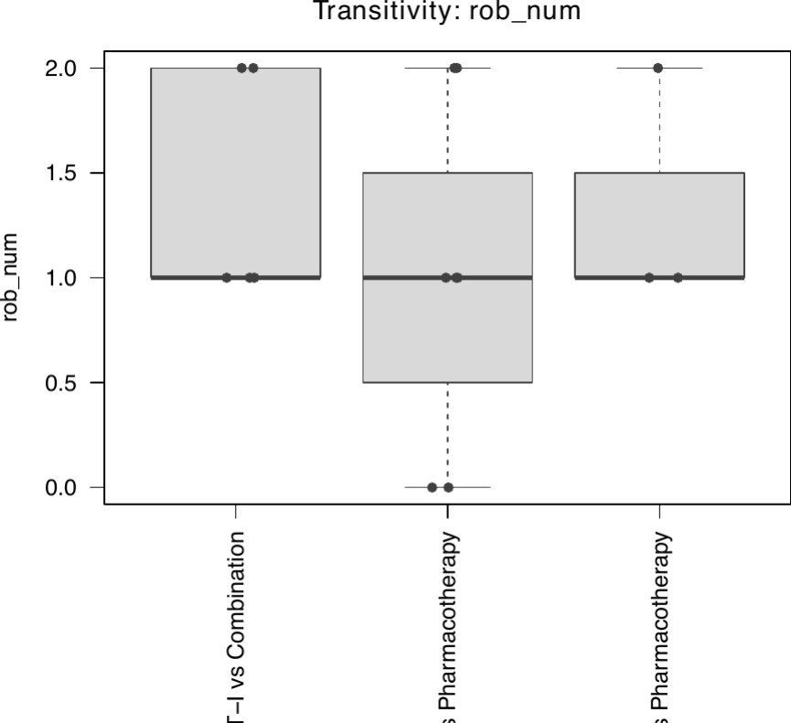
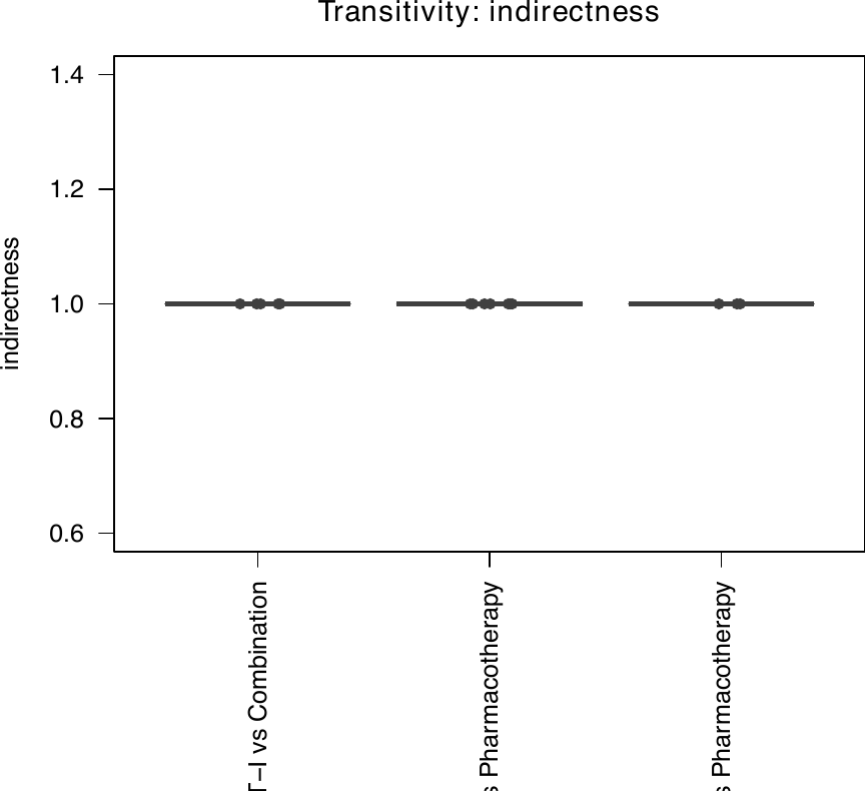

[Manual home](README.md) › Transitivity

# Transitivity

Transitivity is the assumption that underpins every network meta-analysis: that
the treatments could, in principle, have been compared in a single trial, and
that the studies contributing to different comparisons are similar enough for
indirect comparison to be valid. In practice this means the distribution of
effect modifiers — study-level characteristics that could alter the treatment
effect — should be similar across the comparisons in the network.

There is no formal statistical test for transitivity; it is assessed by
judgement, supported by inspecting how potential effect modifiers are
distributed across comparisons. `plot_transitivity()` supports that judgement by
drawing, for each covariate, a strip-and-box plot of study-level values grouped
by direct treatment comparison, so that any imbalance is visible at a glance.

## `plot_transitivity()`

The signature is:

```r
plot_transitivity(data, studlab, treat, covariate_cols,
                  outcome = "transitivity", path = "./outputs",
                  n_min_pair = 2L, trim = TRUE, trim_fuzz = 30L)
```

`data`, `studlab`, and `treat` are the same arm-level inputs used by
`netmetawrap()` (`studlab` and `treat` accept unquoted or quoted names).
`covariate_cols` is a character vector of the columns to visualize.
`n_min_pair` (default `2`) is the minimum number of studies a comparison needs
to be included in a plot. One PDF is written per covariate to
`{path}/{outcome}/transitivity_{outcome}_{covariate}.pdf`.

Each study is assigned to **every** direct comparison it contributes to. A
three-arm study with arms A, B, and C therefore appears in A vs B, A vs C, and
B vs C.

### Example on the W2I data

Two W2I covariates are relevant: risk of bias (`rob`, stored as the letters
`"L"`, `"M"`, `"H"`) and `indirectness` (already numeric). Because
`plot_transitivity()` plots numeric columns only, the letter-coded risk of bias
must first be converted to a numeric column:

```r
library(nmatools)

d <- load_w2i()

# Risk of bias: "L" / "M" / "H" → 0 / 1 / 2 (ordered severity)
d$rob_num <- c("L" = 0, "M" = 1, "H" = 2)[d$rob]

plot_transitivity(
  data           = d,
  studlab        = id,
  treat          = t,
  covariate_cols = c("rob_num", "indirectness"),
  outcome        = "remission_lt",
  path           = "./outputs"
)
# → outputs/remission_lt/transitivity_remission_lt_rob_num.pdf
# → outputs/remission_lt/transitivity_remission_lt_indirectness.pdf
```


*Study-level risk of bias (numeric) by direct comparison, shown as a box plot
overlaid with jittered study points.*


*Study-level indirectness by direct comparison; a flat distribution across
comparisons is reassuring for transitivity.*

## Data-preparation rules

`plot_transitivity()` applies a few consistent rules; preparing your covariates
accordingly avoids surprises.

- **Numeric covariates only.** Non-numeric columns are skipped with a message.
  Convert categorical or letter-coded variables to numeric first. For an
  unordered category, map its levels to integers with a named vector, for
  example `c("RCT" = 0, "quasi-RCT" = 1, "observational" = 2)[d$design]`.

- **Proportions, not percentages.** Express a proportion on the 0–1 scale, not
  as a percentage. A "65%" female column should be divided by 100
  (`d$female_prop <- d$female_pct / 100`). Raw percentages still plot with
  correct relative differences, but the y-axis is misleading (values like 45–75
  instead of 0.45–0.75).

- **Multi-arm aggregation.** Study-level characteristics are often stored
  redundantly in every arm row. For each study and covariate,
  `plot_transitivity()` reduces the arm values to a single number: with several
  non-`NA` arm values it takes their **simple mean**; with exactly one non-`NA`
  value it uses that value as-is; if all arm values are `NA`, the study is
  **excluded** from that covariate's plot.

- **Sparse-comparison filtering.** Comparisons with fewer than `n_min_pair`
  studies are dropped from the plot. If no comparison meets the threshold, the
  function reports this and produces no plot for that covariate.

## Interpreting the plots

Read each plot comparison by comparison. The transitivity assumption is
supported when a covariate's distribution looks **similar across all
comparisons** — comparable medians, spreads, and ranges. A comparison whose box
sits well above or below the others marks a covariate that is distributed
unevenly across the network; if that covariate is a plausible effect modifier,
it is a threat to transitivity and, by extension, to the validity of the
indirect and mixed estimates.

These plots are a screening aid, not a verdict. A visible imbalance flags a
covariate for closer scrutiny — a narrative discussion, a sensitivity analysis
restricted to comparable studies, or a network meta-regression on that
covariate — rather than settling the question on its own. Interpret the picture
together with clinical reasoning about which covariates could genuinely modify
the treatment effect.

---
Prev: [Batch runs and rare events](04-batch-and-rare-events.md) · Next: [GUI overview](06-gui-overview.md)
