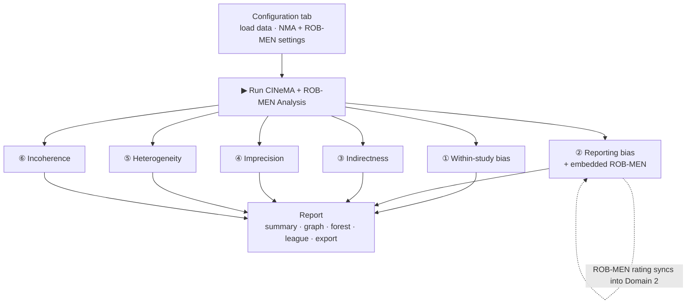

[Manual home](README.md) › GUI overview

# 6. The `cinema()` GUI: overview and orientation

`nmatools::cinema()` launches an interactive Shiny application for assessing
confidence in the results of a network meta-analysis (NMA). The application
implements two complementary frameworks:

- **CINeMA** — *Confidence In Network Meta-Analysis* — a structured, six-domain
  approach to rating the confidence in each NMA estimate
  (Nikolakopoulou et al. 2020; Papakonstantinou et al. 2020).
- **ROB-MEN** — *Risk Of Bias due to Missing Evidence in Network meta-analysis*
  — an assessment of whether missing (unpublished or selectively unreported)
  studies bias each estimate (Chiocchia et al. 2021).

The two frameworks are wired together: the ROB-MEN result for each comparison
feeds CINeMA Domain 2 (Reporting bias), and all six CINeMA domains feed the
final Report.

This chapter orients you to the launch modes, the navigation bar, and the
overall workflow. Chapters 7–10 walk through each part of the interface in
step-by-step detail.

---

## 6.1 Launching the application

`cinema()` accepts an optional pre-loaded data frame and offers three launch
modes.

### Mode 1 — Launch empty, upload inside the GUI

```r
library(nmatools)
cinema()
```

The application opens with no data loaded. You then either upload a CSV/XLSX
file or click **Load SLEEPI demo data** on the Configuration tab (see
[Chapter 7](07-gui-configuration.md)).

### Mode 2 — Pre-load a data frame from R

```r
d <- load_w2i()                                  # bundled insomnia sample
cinema(d, format = "binary", effect_measure = "OR")
```

Pass a `data.frame` together with a `format` and an `effect_measure`:

| Argument | Accepted values | Meaning |
| --- | --- | --- |
| `format` | `"continuous"` | Arm-level continuous data (columns `studlab` / `treat` / `n` / `mean` / `sd`) |
| | `"binary"` | Arm-level binary data (columns `studlab` / `treat` / `n` / `event`) |
| | `"pairwise"` | Pre-computed pairwise effects (columns `studlab` / `t1` / `t2` / `y` / `se`) |
| `effect_measure` | `"SMD"`, `"MD"`, `"OR"`, `"RR"` | The effect measure the analysis will use |

When `data` is supplied, the upload step is bypassed and the Configuration tab
shows a "Data injected from R session" banner. Column names are lower-cased and
trimmed automatically, common aliases are auto-detected and renamed (e.g.
`id`/`study` → `studlab`, `t`/`treatment` → `treat`, `r`/`events` → `event`),
and `rob` / `indirectness` values such as `L`/`M`/`H` or `1`/`2`/`3` are
auto-mapped to `low` / `some concerns` / `high` — the same behavior as an
in-GUI upload. If the data still cannot be converted, the app launches empty
and a warning explaining why is printed to the R console. The `format` and
`effect_measure` arguments are ignored when `data = NULL`.

### Mode 3 — Return the app object instead of launching (`launch = FALSE`)

```r
app <- cinema(launch = FALSE)   # returns the shinyApp object; does not open a browser
```

Set `launch = FALSE` to obtain the `shinyApp` object without running it. This is
the form required for deployment to a hosting service such as
[shinyapps.io](https://www.shinyapps.io/). When `launch = TRUE` (the default),
the app is opened immediately in your browser via `shiny::runApp()`.

> **Note.** On startup the application forces the `en_US.UTF-8` locale so that
> the CINeMA and ROB-MEN judgement labels render identically on every platform.

---

## 6.2 The navigation bar


*Figure 6.1 — The application on first launch. The navigation bar exposes eight
tabs; only the Configuration tab holds usable controls until an analysis has
been run.*

The navigation bar carries **eight tabs**, in this exact order:

| Tab | Purpose |
| --- | --- |
| **Configuration** | Load data, confirm the data format, choose NMA and ROB-MEN settings, and run the analysis. |
| **① Within-study bias** | CINeMA Domain 1 — contribution-weighted risk-of-bias rating per comparison. |
| **② Reporting bias** | CINeMA Domain 2 — hosts the embedded ROB-MEN assessment plus the Domain 2 final ratings. |
| **③ Indirectness** | CINeMA Domain 3 — contribution-weighted indirectness rating per comparison. |
| **④ Imprecision** | CINeMA Domain 4 — zone-based analysis of the confidence interval against the clinical threshold δ. |
| **⑤ Heterogeneity** | CINeMA Domain 5 — confidence interval vs prediction interval zone-crossing analysis. |
| **⑥ Incoherence** | CINeMA Domain 6 — SIDE (node-splitting) / global inconsistency test plus zone overlap. |
| **Report** | Summary traffic-light grid, network graph, forest plot, league table, and the export bundle. |

The six domain tabs (①–⑥) and the Report tab are populated only after you click
**▶ Run CINeMA + ROB-MEN Analysis** on the Configuration tab. Before that, each
domain tab shows an informational banner prompting you to configure and run the
analysis.

> The circled-number glyphs ①②③④⑤⑥ are part of the tab labels themselves; the
> chapters that follow refer to them exactly as they appear on screen.

---

## 6.3 The intended workflow

The application is designed to be worked through from left to right. State flows
in one direction, with one important back-link: the ROB-MEN result computed
inside Domain 2 is synced back into CINeMA Domain 2, and all six domains then
propagate into the Report.



*Figure 6.2 — Workflow arc. Running the analysis on the Configuration tab
computes all six domains; the ROB-MEN assessment feeds Domain 2; every domain
then contributes to the Report.*

Each domain is **auto-computed** by an algorithm and then open to **manual
override**. Overrides you set on a domain tab propagate to the Report's summary
table and to every export. The recommended sequence is:

1. **Configure** — load data, confirm the format, and set NMA and ROB-MEN options
   ([Chapter 7](07-gui-configuration.md)).
2. **Run** — click **▶ Run CINeMA + ROB-MEN Analysis**.
3. **Review Domains ①③④⑤⑥** — inspect each auto-computed rating and override
   where expert judgement differs ([Chapter 8](08-gui-cinema-domains.md)).
4. **Review Domain ②** — complete the ROB-MEN assessment and confirm the Domain 2
   final ratings ([Chapter 9](09-gui-robmen.md)).
5. **Report and export** — set the palette and downgrade algorithm, assign
   confidence levels, and download the bundle
   ([Chapter 10](10-gui-report-export.md)).

---

Prev: [5. Transitivity](05-transitivity.md) · Next: [7. Configuration tab](07-gui-configuration.md)
