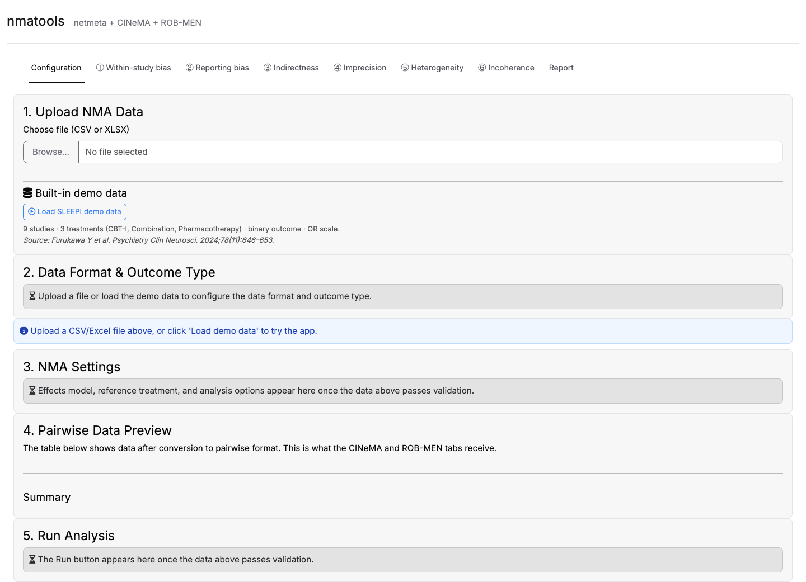
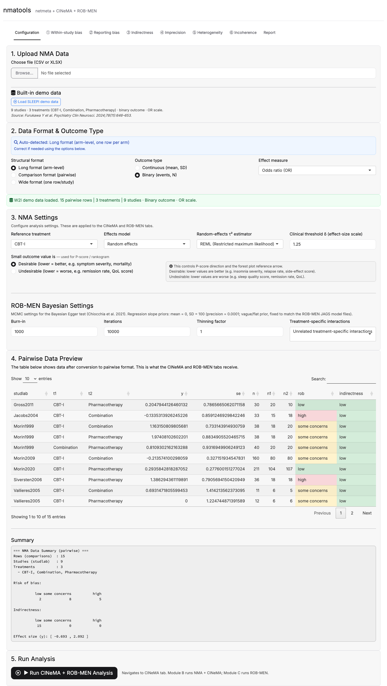
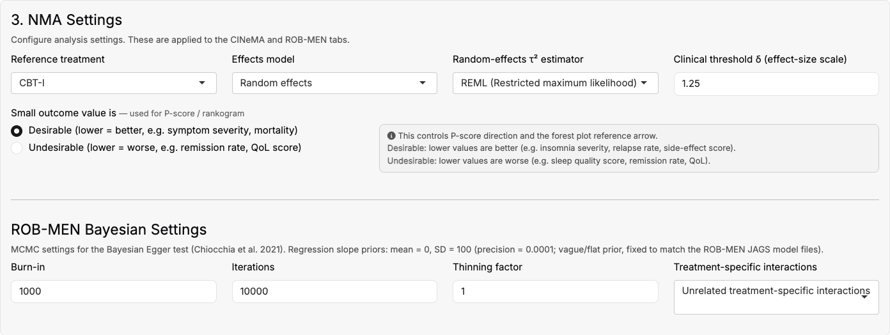
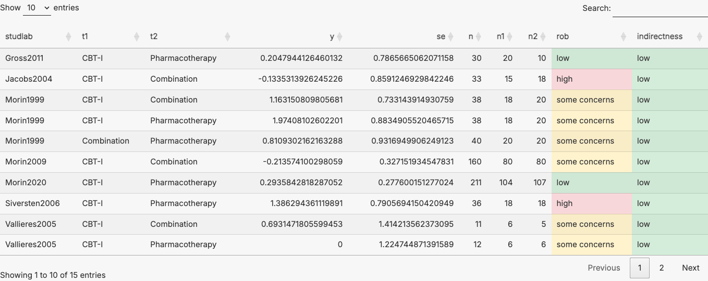
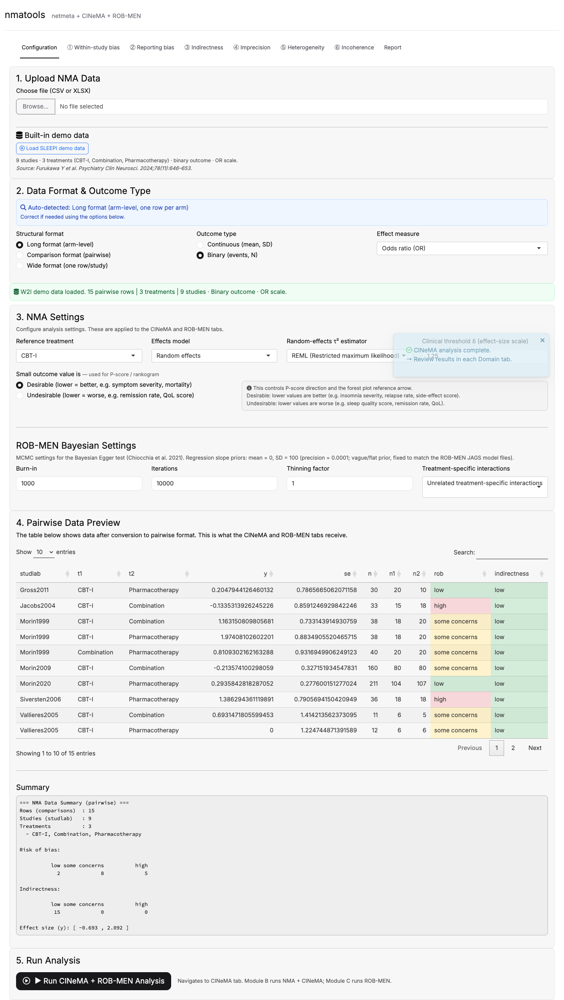

[Manual home](README.md) › Configuration tab

# 7. The Configuration tab, step by step

The Configuration tab is the single point of entry for every analysis. It is
organized as five numbered sections that reveal themselves progressively as the
data become valid:

1. **Upload NMA Data**
2. **Data Format & Outcome Type**
3. **NMA Settings** (including **ROB-MEN Bayesian Settings**)
4. **Pairwise Data Preview**
5. **Run Analysis**

Work through them from top to bottom. This chapter documents each in turn, using
the bundled SLEEPI demo data as the worked example.

---

## 7.1 Step 1 — The initial empty state

*Figure 7.1 — On first launch, section 1 (Upload) is active; sections 2, 3, and 5
show gray "hourglass" placeholders explaining that they will populate once data
are loaded and validated.*

Before any data are present, sections 2, 3, and 5 display placeholder panels so
that the section titles remain visible. A blue information banner reads:
"Upload a CSV/Excel file above, or click **Load demo data** to try the app."

---

## 7.2 Step 2 — Load data

You have two ways to bring data into the application.

### Option A — Upload your own file

1. In section **1. Upload NMA Data**, click **Browse...**
2. Choose a `.csv` or `.xlsx` file.

The file is read, and its column names are lower-cased and trimmed. The
application then auto-detects the structural format (see Step 3).

### Option B — Load the bundled demo data

1. Click **Load SLEEPI demo data** (the green outlined button under "Built-in
   demo data").

The caption beneath the button describes the dataset:

> 9 studies · 3 treatments (CBT-I, Combination, Pharmacotherapy) · binary
> outcome · OR scale. *Source: Furukawa Y et al. Psychiatry Clin Neurosci.
> 2024;78(11):646–653.*

*Figure 7.2 — After loading the demo data, the format is auto-detected as Long /
Binary / OR, and a green banner confirms: "W2I demo data loaded. 15 pairwise
rows | 3 treatments | 9 studies · Binary outcome · OR scale."*

---

## 7.3 Step 3 — Data Format & Outcome Type

Once raw data are present, section **2. Data Format & Outcome Type** appears with
a blue banner reporting the auto-detected structural format, for example:
"Auto-detected: **Long format (arm-level, one row per arm)**." Correct it below
if the detection is wrong.

Three controls are provided:

1. **Structural format** (radio buttons):
   - **Long format (arm-level)** — one row per treatment arm.
   - **Comparison format (pairwise)** — one row per pairwise comparison.
   - **Wide format (one row/study)** — one row per study, with numbered arm
     columns.
2. **Outcome type** (radio buttons): **Continuous (mean, SD)** or **Binary
   (events, N)**. When the structural format is *Comparison*, this collapses to
   a single **Generic / pre-computed (y, SE)** option.
3. **Effect measure** (dropdown): the choices adapt to the outcome type —
   SMD/MD for continuous data, OR/RR for binary or generic data.

> **Column mapping (uploaded files only).** When you upload your own file, an
> additional **Column Mapping** panel appears below section 2. It auto-matches
> each of your columns to the required fields (marked `*`) and lets you correct
> any mismatch. If your risk-of-bias or indirectness column uses non-standard
> labels, a **ROB / Indirectness Value Mapping** panel also appears so you can
> map each raw value to *Low risk*, *Some concerns*, *High risk*, or *(Exclude
> row)*. The demo data are already standardised, so these panels do not appear
> for it.

A validation banner beneath these panels reports success ("Data loaded
successfully. *N* pairwise rows | *k* treatments | *m* studies") or the first
error/warning encountered.

---

## 7.4 Step 4 — NMA Settings

Once the data pass validation, section **3. NMA Settings** appears.

*Figure 7.3 — The NMA Settings card. These options are applied to both the
CINeMA and ROB-MEN analyses.*

Set the following:

1. **Reference treatment** (dropdown) — defaults to a control-like treatment if
   one is recognised (e.g. `WL`, `PLB`, `Placebo`, `Control`), otherwise the
   first treatment alphabetically. For the demo data the default is **CBT-I**.
2. **Effects model** (dropdown) — **Random effects** (default) or **Common
   effect**.
3. **Random-effects τ² estimator** (dropdown, shown only for the random-effects
   model): **REML** (default), **DL (DerSimonian–Laird)**, or **ML (Maximum
   likelihood)**.
4. **Clinical threshold δ (effect-size scale)** (numeric) — the equivalence
   threshold used by Domains 4, 5, and 6. A sensible default is filled in per
   effect measure; you can revise it here or later on the ④ Imprecision tab.
5. **Small outcome value is** (radio) — **Desirable** (lower = better, e.g.
   symptom severity, mortality) or **Undesirable** (lower = worse, e.g.
   remission rate, QoL score). This single choice controls **the P-score
   direction and the forest-plot reference arrow**; it does not change the
   estimates themselves.

---

## 7.5 Step 5 — ROB-MEN Bayesian settings and the pairwise preview

Below the NMA settings, the **ROB-MEN Bayesian Settings** block configures the
MCMC used by the Bayesian Egger test (Chiocchia et al. 2021).

*Figure 7.4 — The ROB-MEN MCMC settings (top) and the pairwise data preview
(bottom), which shows exactly the data frame the CINeMA and ROB-MEN tabs
receive.*

The MCMC controls are:

1. **Burn-in** (numeric, default 1000).
2. **Iterations** (numeric, default 10000).
3. **Thinning factor** (numeric, default 1).
4. **Treatment-specific interactions** (dropdown): **Unrelated
   treatment-specific interactions** (default), **Exchangeable interactions**,
   or **Common interaction**.

> The regression-slope priors are fixed at mean = 0, SD = 100 (precision =
> 0.0001; a vague/flat prior) to match the ROB-MEN JAGS model files. They are
> not user-editable.

**Section 4 — Pairwise Data Preview** shows the pairwise-format data frame that
the analysis will actually use (columns `studlab`, `t1`, `t2`, `y`, `se`, `n`,
`n1`, `n2`, `rob`, `indirectness`). The `rob` and `indirectness` cells are
color-coded green / amber / red for low / some concerns / high. A text summary
beneath lists the number of comparisons, studies, treatments, and the range of
the effect size.

---

## 7.6 Step 6 — Run the analysis

Once the data are valid, section **5. Run Analysis** exposes the run button.

1. Click **▶ Run CINeMA + ROB-MEN Analysis**.

The full pipeline runs: `netmeta` fits the NMA, the contribution matrix and
node-splitting are computed for CINeMA, and the Bayesian Egger test (JAGS MCMC)
runs for ROB-MEN. This typically completes in about **20–40 seconds**. A
notification toast reports progress ("Analysis started · Data validated · Running
NMA + CINeMA · Running ROB-MEN"), and a second toast confirms completion
("CINeMA analysis complete"). The view then navigates to the CINeMA tabs.

*Figure 7.5 — After **▶ Run CINeMA + ROB-MEN Analysis** completes, the domain
tabs ①–⑥ and the Report tab are populated and a completion toast is shown.*

---

## 7.7 Troubleshooting

| Symptom | Likely cause and fix |
| --- | --- |
| Red **Error** banner: "Please map all required columns (\*)…" | An uploaded file has an unmapped required field. Open the Column Mapping panel and set every field marked `*`. |
| Red **Error** banner: "Missing columns: …" | The chosen outcome type does not match the columns present (e.g. Binary selected but no `event` column). Correct the outcome type in section 2. |
| Amber **Warning**: "Possibly incomplete multi-arm data…" | A multi-arm study lacks the *k*(*k*−1)/2 pairwise rows it needs. `netmeta` may reject it; supply all pairwise rows for that study. |
| Format detected incorrectly | Override the auto-detected **Structural format** and **Outcome type** radios in section 2. |
| Own data vs demo data | The demo dataset ships with standardised `rob` / `indirectness` columns; your own file may need the ROB / Indirectness Value Mapping panel. If a ROB or indirectness column is absent entirely, every row defaults to `low`. |
| Run button not visible | The Run section shows a placeholder until the data pass validation. Resolve any error/warning banner first. |

---

Prev: [6. GUI overview](06-gui-overview.md) · Next: [8. CINeMA domains](08-gui-cinema-domains.md)
