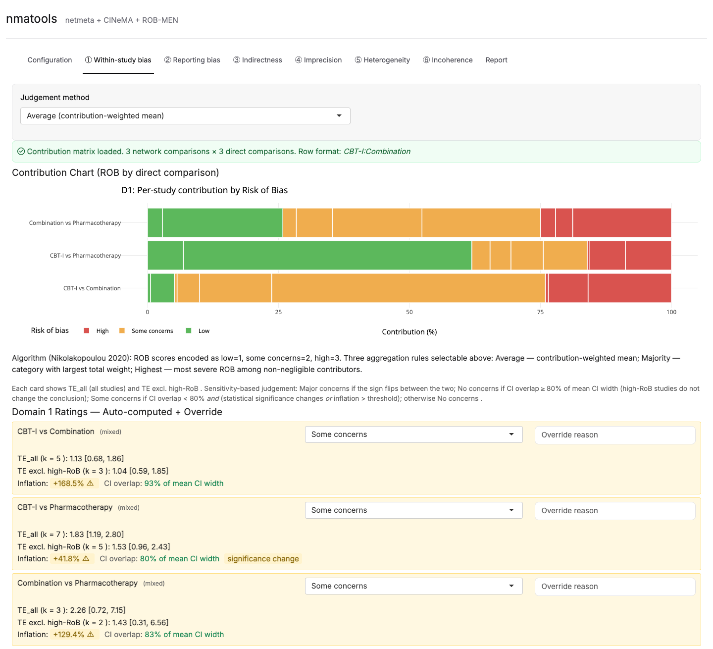
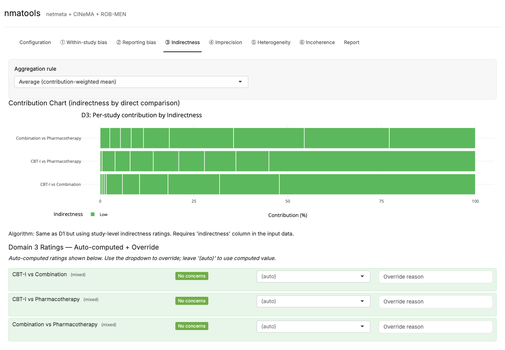
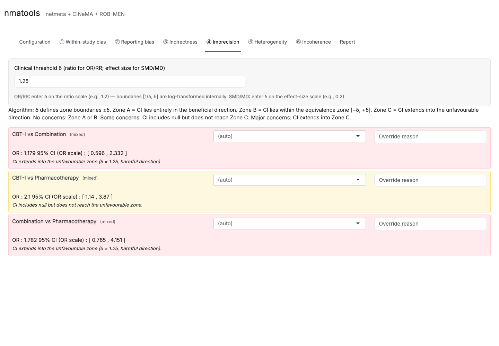
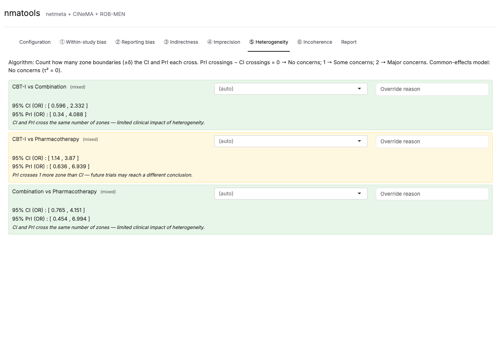
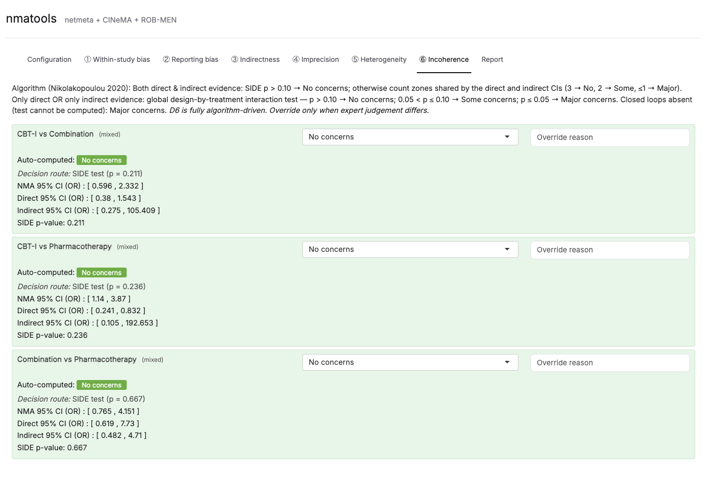

[Manual home](README.md) › CINeMA domains

# 8. CINeMA domains ①③④⑤⑥

After you run the analysis, the CINeMA domains populate as separate tabs. Each
domain is **auto-computed** by an algorithm (Nikolakopoulou et al. 2020) and then
open to **manual override**. This chapter covers Domains ①, ③, ④, ⑤, and ⑥.
Domain ② (Reporting bias) hosts the ROB-MEN assessment and is covered separately
in [Chapter 9](09-gui-robmen.md).

> **How every domain works.** Each tab presents a per-comparison card or row with
> the algorithm's auto-computed rating and a dropdown to override it. The
> override choices are **(auto)**, **No concerns**, **Some concerns**, **Major
> concerns**, and **Not assessed**. Leaving the dropdown on **(auto)** keeps the
> algorithm's rating. Any override you set here propagates to the Report summary
> table and to every export. Most tabs also provide a free-text "Reason" field
> for documenting the override.

---

## 8.1 Domain ① — Within-study bias

*Figure 8.1 — Domain ①. A stacked contribution chart shows, for each network
comparison, the share of evidence coming from Low / Some concerns / High
risk-of-bias studies; the ratings table below allows overrides.*

**Controls.**

1. **Judgement method** (dropdown):
   - **Average (contribution-weighted mean)** — default.
   - **Majority (largest contribution share)**.
   - **Highest (most severe contributor)**.
   - **Sensitivity-based: CI overlap & inflation**.
2. **Inflation threshold (relative |TE| change)** (numeric, default 0.10) —
   shown only when the Sensitivity-based method is selected.

**Contribution chart.** "Contribution Chart (ROB by direct comparison)" is a
stacked horizontal bar per network comparison. Each study is one segment,
coloured by its own risk of bias. Risk-of-bias scores are encoded **low = 1,
some concerns = 2, high = 3**.

**Algorithm (Nikolakopoulou 2020).** Three aggregation rules are selectable:
**Average** — contribution-weighted mean; **Majority** — the category carrying
the largest total weight; **Highest** — the most severe risk of bias among
non-negligible contributors. The **Sensitivity-based** rule instead compares the
pooled effect from all studies (TE_all) with the pooled effect after excluding
high-risk-of-bias studies (TE excl. high-RoB), and rates:

- **Major concerns** if the sign flips between the two estimates;
- **No concerns** if the confidence intervals overlap by ≥ 80% of the mean CI
  width (high-RoB studies do not change the conclusion);
- **Some concerns** if CI overlap < 80% *and* either statistical significance
  changes *or* the inflation exceeds the threshold;
- **No concerns** otherwise.

**Overriding.** The "Domain 1 Ratings — Auto-computed + Override" table lists
each comparison with its auto rating, a dropdown, and a reason field.

---

## 8.2 Domain ③ — Indirectness

*Figure 8.2 — Domain ③ mirrors Domain ① but uses each study's indirectness
rating rather than its risk of bias.*

**Controls.**

1. **Aggregation rule** (dropdown): **Average (contribution-weighted mean)**
   (default), **Majority (largest contribution share)**, or **Highest (most
   severe contributor)**.

**Contribution chart.** "Contribution Chart (indirectness by direct comparison)"
is the same stacked-bar visualisation as Domain ①, split by each study's
indirectness (Low / Some concerns / High).

**Algorithm.** Identical to Domain ① but using study-level **indirectness**
ratings instead of risk of bias. It requires an `indirectness` column in the
input data; where it is absent, the comparison is rated **Not assessed**.

**Overriding.** The "Domain 3 Ratings — Auto-computed + Override" table provides
the same per-comparison dropdown and reason field.

---

## 8.3 Domain ④ — Imprecision

*Figure 8.3 — Domain ④. Each card reports the NMA estimate with its 95% CI and
the zone into which the interval falls relative to the clinical threshold δ.*

**Controls.**

1. **Clinical threshold δ (ratio for OR/RR; effect size for SMD/MD)** (numeric).
   - For **OR/RR**, enter δ on the **ratio** scale (e.g. `1.2`); the boundaries
     `[1/δ, δ]` are **log-transformed internally** because `netmeta` stores
     effects on the log scale.
   - For **SMD/MD**, enter δ on the **effect-size** scale (e.g. `0.2`).

**Algorithm.** δ defines the equivalence-zone boundaries ±δ:

- **Zone A** — the CI lies entirely in the beneficial direction.
- **Zone B** — the CI lies within the equivalence zone [−δ, +δ].
- **Zone C** — the CI extends into the unfavourable direction.

The rating follows:

- **No concerns** — Zone A or Zone B.
- **Some concerns** — the CI includes the null but does not reach Zone C.
- **Major concerns** — the CI extends into Zone C.

Each per-comparison card prints the estimate, its 95% CI (on the OR/RR scale
where applicable), and the resulting zone verdict, and offers an override
dropdown and reason field.

---

## 8.4 Domain ⑤ — Heterogeneity

*Figure 8.4 — Domain ⑤. Each card compares the 95% CI with the 95% prediction
interval (PrI) and rates the additional imprecision the PrI introduces.*

**Algorithm.** Count how many zone boundaries (±δ) the **CI** and the
**prediction interval (PrI)** each cross, then take the difference:

- **PrI crossings − CI crossings = 0** → **No concerns**;
- **= 1** → **Some concerns**;
- **= 2** → **Major concerns**.

Under a **common-effect model** (τ² = 0) the rating is **No concerns**, since
there is no additional heterogeneity to reflect.

Each card prints the 95% CI and, where available, the 95% PrI, together with the
verdict, and offers an override dropdown and reason field.

---

## 8.5 Domain ⑥ — Incoherence

*Figure 8.5 — Domain ⑥. Each card shows the auto-computed rating, the decision
route taken, and the direct / indirect / NMA confidence intervals where
available.*

**Algorithm (Nikolakopoulou 2020).** The rule depends on the evidence available
for each comparison:

- **Both direct and indirect evidence** — the SIDE (node-splitting) p-value is
  used: **p > 0.10 → No concerns**; otherwise count the zones shared by the
  direct and indirect CIs (**3 → No concerns, 2 → Some concerns, ≤ 1 → Major
  concerns**).
- **Only direct or only indirect evidence** — the global design-by-treatment
  interaction test is used: **p > 0.10 → No concerns; 0.05 < p ≤ 0.10 → Some
  concerns; p ≤ 0.05 → Major concerns**.
- **Closed loops absent (the test cannot be computed)** — **Major concerns**.

Each card shows the auto-computed rating badge, the decision route with its
p-value, and the NMA / direct / indirect confidence intervals.

> Domain ⑥ is **fully algorithm-driven**. The on-screen guidance advises:
> "Override only when expert judgement differs."

---

## 8.6 General note on overrides

Every domain follows the same pattern: an auto-computed rating plus a
per-comparison manual override (and, on most tabs, a documented reason).
Overrides you set on any domain tab flow through to the Report's summary table
(Chapter 10) and into every exported artefact. Domain ② (Reporting bias) is the
one domain whose rating is produced by a separate assessment; see
[Chapter 9](09-gui-robmen.md).

---

Prev: [7. Configuration tab](07-gui-configuration.md) · Next: [9. ROB-MEN](09-gui-robmen.md)
