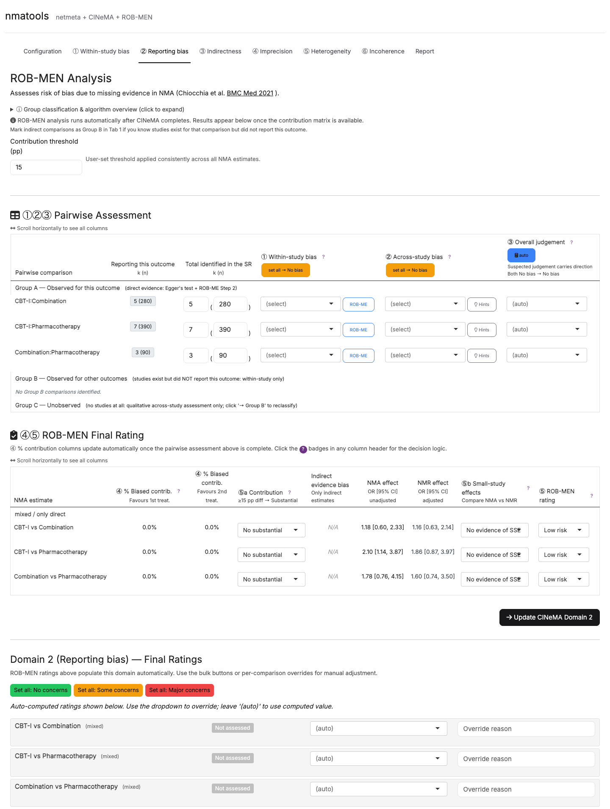
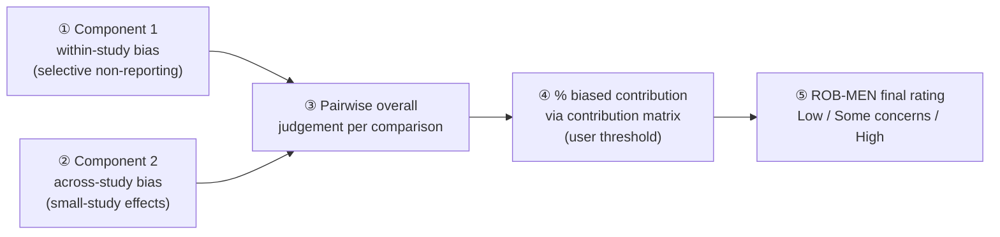
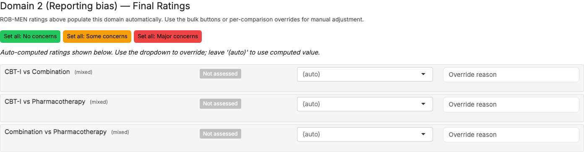

[Manual home](README.md) › ROB-MEN

# 9. ROB-MEN: risk of bias due to missing evidence

**ROB-MEN** (Risk Of Bias due to Missing Evidence in Network meta-analysis)
evaluates whether *missing* studies — unpublished, or eligible studies that
selectively did not report the outcome of interest — bias each NMA estimate
(Chiocchia et al. 2021; guidance in Chiocchia et al. 2023). In the `cinema()`
application the ROB-MEN assessment lives **inside the ② Reporting bias tab**, and
its per-comparison result is synced into CINeMA Domain 2.

*Figure 9.1 — The ROB-MEN analysis embedded in the ② Reporting bias tab. It runs
automatically after CINeMA completes, once the contribution matrix is available.*

---

## 9.1 Where it lives and when it runs

The tab opens with the heading **ROB-MEN Analysis** and the note that it
"Assesses risk of bias due to **missing evidence** in NMA (Chiocchia et al. BMC
Med 2021)." ROB-MEN runs automatically after CINeMA finishes; results appear once
the contribution matrix is ready. An expandable panel, **Group classification &
algorithm overview**, documents the method.

At the top of the tab, one control governs the whole assessment:

- **Contribution threshold (pp)** (numeric, default **15**) — a
  percentage-point threshold applied consistently across all NMA estimates when
  deciding whether biased contribution is "substantial".

---

## 9.2 Group classification

Each comparison is classified into one of three groups, which determines what is
assessed:

| Group | Definition | What is assessed |
| --- | --- | --- |
| **Group A (Observed)** | Direct evidence exists for this outcome. | **Both** components (within-study *and* across-study). |
| **Group B (Other outcomes)** | Studies exist for the comparison but did **not** report this outcome. | **Component 1 only** (within-study selective non-reporting). |
| **Group C (Unobserved)** | No studies at all for this comparison. | **Component 2 qualitative only** (across-study). |

In Tab 1, indirect comparisons default to Group C; mark one as **Group B** if you
know studies exist for it but did not report the current outcome.

---

## 9.3 The algorithm flow

*Figure 9.2 — The five-step ROB-MEN flow. Steps ①–③ are completed on Tab 1
(Pairwise Assessment); steps ④–⑤ on Tab 2 (ROB-MEN Final Rating).*

1. **Component 1 — within-study selective non-reporting.** A qualitative
   judgement using the ROB-ME Step 2 signalling questions (Page & Sterne, BMJ
   2023). It is **not** auto-populated from RoB 2 scores; the user completes it
   via the **ROB-ME** helper button. Output: *No bias detected* or *Suspected
   bias favouring X*.
2. **Component 2 — across-study small-study effects.** Qualitative conditions
   (gray-literature search, novel-agent bias, prior publication-bias evidence)
   plus, where k ≥ 10 studies, a quantitative Bayesian Egger test. Output: *No
   bias detected* or *Suspected bias favouring X*.
3. **Pairwise overall judgement** (per comparison). If **either** component is
   "Suspected bias favouring X", the overall judgement carries X; if **both** are
   "No bias detected", the overall is "No bias detected". Where both components
   are suspected in conflicting directions, the within-study direction takes
   precedence. For Group C the overall equals the across-study assessment only.
4. **% biased contribution.** From the contribution matrix, the percentage of
   each estimate's evidence that comes from comparisons judged biased, split by
   the treatment it favors. If the difference between the two sides reaches the
   contribution threshold (default 15 pp), the biased contribution is
   "Substantial – favouring one treatment"; if the larger side alone reaches the
   threshold, "Substantial – balanced"; otherwise "No substantial contribution".
5. **ROB-MEN final rating** — **Low risk**, **Some concerns**, or **High risk**,
   following Table 5 of Chiocchia 2021. In brief: no substantial contribution and
   no small-study effects → Low; balanced contribution and no small-study effects
   → Low; contribution favouring one treatment with small-study effects
   *reinforcing* it → High; for only-indirect estimates, indirect-evidence bias
   in the same direction → High; otherwise → Some concerns.

---

## 9.4 Tab 1 — Pairwise Assessment

The Pairwise Comparisons Table has one row per comparison. Reading across, each
row shows:

- the comparison label and the *k (N)* of studies reporting this outcome
  (auto-derived, read-only);
- the total *k (N)* identified in the systematic review (auto-filled, editable —
  increase it if the SR contains studies for this comparison that did not report
  this outcome);
- the **within-study bias** cell — a dropdown (*No bias detected* / *Suspected
  bias favouring t1* / *Suspected bias favouring t2*) with a **ROB-ME** button
  that opens the ROB-ME Step 2 helper (Q1: were eligible studies missing? Q2:
  selective omission direction?), backed by a forest plot of the comparison;
- the **across-study bias** cell — a dropdown with either a **Funnel** button
  (when k ≥ 10, showing the contour-enhanced funnel plot, Egger's test, and
  trim-and-fill) or a **Hints** button (when k < 10, listing the qualitative
  conditions);
- the **pairwise overall** dropdown, defaulting to **(auto)** — the value
  computed by step 3.

> **Background plots (Component 2).** For comparisons with k ≥ 10 direct studies,
> the app runs a Bayesian Egger test using the MCMC settings from the
> Configuration tab and provides funnel and forest background plots. With fewer
> than 10 studies, the quantitative test is not applicable and only the
> qualitative Hints are offered.

---

## 9.5 Tab 2 — ROB-MEN Final Rating

The ROB-MEN Table has one row per NMA estimate. It reports:

- the **% biased contribution** favouring each treatment (with the side carrying
  more biased contribution accented, and a threshold flag when the difference
  reaches the contribution threshold);
- the **contribution evaluation** dropdown (*No substantial* / *Substantial –
  balanced* / *Substantial – favouring one*), pre-filled by the algorithm;
- for indirect-only estimates, an **indirect-evidence bias** dropdown;
- the NMA estimate and the NMR (network meta-regression) effect at the smallest
  observed variance, for reading small-study patterns;
- the **small-study-effects** dropdown (*No evidence* / *Evidence – reinforcing*
  / *Evidence – not reinforcing*);
- the **ROB-MEN final rating** dropdown (**Low risk** / **Some concerns** /
  **High risk**), pre-filled by the algorithm and overridable.

---

## 9.6 Domain 2 Final Ratings

Below the ROB-MEN tables, the **Domain 2 (Reporting bias) — Final Ratings**
section is where the ROB-MEN result becomes the CINeMA Domain 2 rating.

*Figure 9.3 — The Domain 2 Final Ratings section. ROB-MEN ratings populate this
domain automatically; bulk buttons and per-comparison dropdowns allow manual
adjustment.*

The guidance reads: "ROB-MEN ratings above populate this domain automatically.
Use the bulk buttons or per-comparison overrides for manual adjustment." Three
bulk buttons act on all comparisons at once:

- **Set all: No concerns**
- **Set all: Some concerns**
- **Set all: Major concerns**

Below them, each comparison has its own override dropdown. The ROB-MEN final
ratings map into CINeMA Domain 2 as follows:

| ROB-MEN rating | CINeMA Domain 2 |
| --- | --- |
| Low risk | No concerns |
| Some concerns | Some concerns |
| High risk | Major concerns |
| (unassessed) | Not assessed |

These Domain 2 ratings then feed the Report exactly like the other five domains.

---

Prev: [8. CINeMA domains](08-gui-cinema-domains.md) · Next: [10. Report and export](10-gui-report-export.md)
