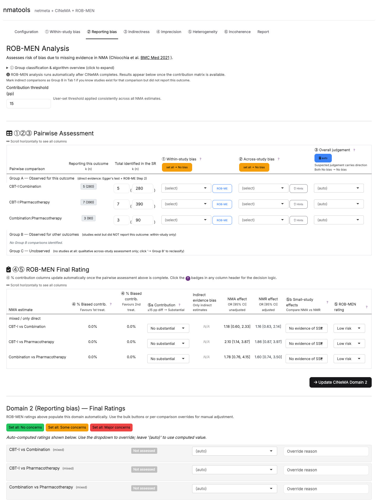
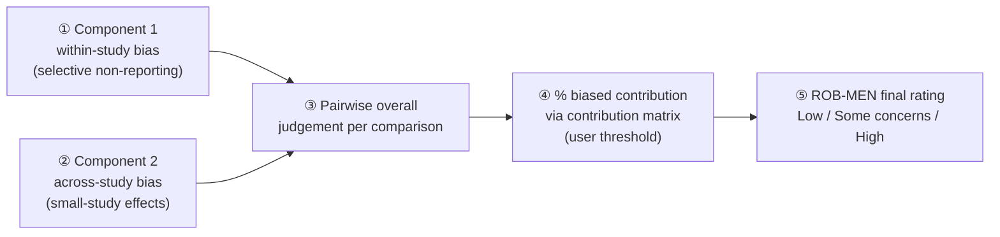
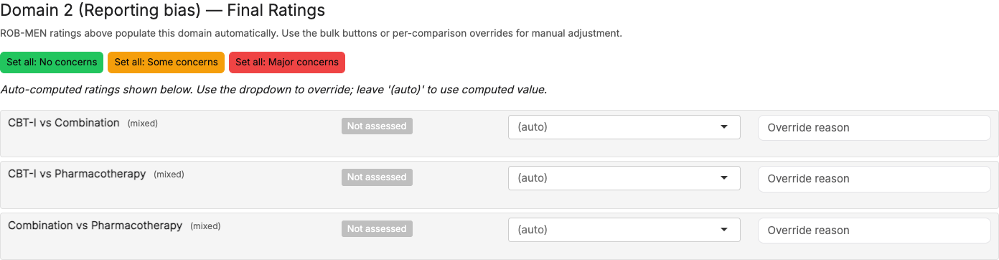

[Manual home](README.md) › ROB-MEN

# 9. ROB-MEN: risk of bias due to missing evidence

**ROB-MEN** (Risk Of Bias due to Missing Evidence in Network meta-analysis)
evaluates whether *missing* studies — unpublished, or eligible studies that
selectively did not report the outcome of interest — bias each NMA estimate
(Chiocchia et al. 2021; guidance in Chiocchia et al. 2023). In the `cinema()`
application the ROB-MEN assessment lives **inside the ② Reporting bias tab**, and
its per-comparison result is synced into CINeMA Domain 2.



*Figure 9.1 — The ROB-MEN analysis embedded in the ② Reporting bias tab. It runs
automatically after CINeMA completes, once the contribution matrix is available.*

---

## 9.1 Where it lives, when it runs, and what is automatic

The tab opens with the heading **ROB-MEN Analysis** and the note that it
"Assesses risk of bias due to **missing evidence** in NMA (Chiocchia et al. BMC
Med 2021)." ROB-MEN runs automatically after CINeMA finishes; results appear once
the contribution matrix is ready. An expandable panel, **Group classification &
algorithm overview**, documents the method.

**Every judgement in both ROB-MEN tables is pre-filled by an algorithm**, and
the final ratings are synced into CINeMA Domain 2 without any further click.
With the default settings, a complete CINeMA table (all six domains) is
available on the Report tab as soon as the analysis finishes. Rows whose
auto-judgement is *provisional* — because it rests on an assumption the data
cannot verify — are flagged with ⚠ so that you know exactly where a human
decision is still needed (Section 9.7).

Two blocks of controls sit above the tables:

- **Contribution threshold (pp)** (numeric, default **15**) — a
  percentage-point threshold applied consistently across all NMA estimates when
  deciding whether biased contribution is "substantial".
- **⚙ Automation settings & review-level conditions** — see Section 9.4.1.

---

## 9.2 Group classification

Each comparison is classified into one of three groups, which determines what is
assessed:

| Group | Definition | What is assessed |
| --- | --- | --- |
| **Group A (Observed)** | Direct evidence exists for this outcome. | **Both** components (within-study *and* across-study). |
| **Group B (Other outcomes)** | Studies exist for the comparison but did **not** report this outcome. | **Component 1 only** (within-study selective non-reporting). |
| **Group C (Unobserved)** | No studies at all for this comparison. | **Component 2 qualitative only** (across-study). |

The classification is derived automatically from two counts per comparison:

- **k reporting this outcome** — auto-derived from the NMA data (read-only);
- **k identified in the SR** — the editable *Total identified in the SR* cell.
  It is pre-filled **from the data sheet** when the sheet lists studies (or
  arms) with blank outcome cells (see below); otherwise it defaults to the
  reporting count.

Comparisons with direct evidence are Group A. An indirect comparison is Group C
unless **k ≥ 1** under *Total identified in the SR* — from the sheet, typed in,
or set by clicking **→ Group B** (k = 1) — in which case it becomes Group B.
Clicking **← Group C** sets k back to 0.

> **Let the data sheet do the counting.** Keep every study identified in your
> systematic review in the input sheet and leave the outcome cells blank for
> studies or arms that did not report this outcome (a blank `n` is fine on
> those rows). The Configuration tab reports how many such studies were found;
> the ② tab then pre-fills *Total identified in the SR* for every comparison,
> classifies indirect comparisons with such studies as Group B, answers
> ROB-ME Q1 = Yes for them, and names the studies under the ① dropdown and in
> the ROB-ME helper. Nothing needs to be typed. See
> [Chapter 2](02-data-formats.md).

---

## 9.3 The algorithm flow


```mermaid
flowchart LR
    C1["① Component 1<br/>within-study bias<br/>(selective non-reporting)"]
    C2["② Component 2<br/>across-study bias<br/>(small-study effects)"]
    OV["③ Pairwise overall<br/>judgement per comparison"]
    PC["④ % biased contribution<br/>via contribution matrix<br/>(user threshold)"]
    FR["⑤ ROB-MEN final rating<br/>Low / Some concerns / High"]
    C1 --> OV
    C2 --> OV
    OV --> PC
    PC --> FR
```

*Figure 9.2 — The five-step ROB-MEN flow. Steps ①–③ are completed on Tab 1
(Pairwise Assessment); steps ④–⑤ on Tab 2 (ROB-MEN Final Rating).*

1. **Component 1 — within-study selective non-reporting.** The ROB-ME Step 2
   signalling questions (Page & Sterne, BMJ 2023), answered from the SR counts:
   - *k in SR = k reporting* → Q1 = No → **No bias detected** (auto).
   - *k in SR > k reporting* → Q1 = Yes → **Suspected bias favouring X**
     (provisional, ⚠), where X comes from the bias-favour ordering (Section
     9.4.1) when both treatments are ranked, else from a single novel agent,
     else from the treatment favoured by the observed effect (the pooled
     direct estimate for Group A; the NMA estimate for Group B), because
     selective non-reporting suppresses results unfavourable to the treatment
     the published evidence favours. Confirm or change it with the **ROB-ME**
     helper. When no direction is available, the row is left at *No bias
     detected* and flagged.
   It is never proxied from RoB 2 scores.
2. **Component 2 — across-study small-study effects.**
   - *k ≥ 10 studies* → Egger's test: p ≥ 0.05 → **No bias detected**;
     p < 0.05 → **Suspected bias favouring** the treatment the funnel asymmetry
     favours (flagged ⚠ so you check the funnel plot).
   - *k < 10 studies, and Group C* → the **review-level conditions** from the
     ROB-MEN paper, answered once for the whole review (Section 9.4.1):
     score = (conditions suggesting bias) − (conditions suggesting no bias);
     score ≤ 0 → **No bias detected**; score > 0 → **Suspected bias favouring**
     the treatment ranked higher in the bias-favour ordering, else the flagged
     novel agent, else the treatment the observed effect favours
     (provisional, ⚠).
   All "favouring X" directions honour the **Small outcome value is** setting
   from the Configuration tab (desirable vs undesirable), for OR/RR/SMD/MD alike.
3. **Pairwise overall judgement** (per comparison). If **either** component is
   "Suspected bias favouring X", the overall judgement carries X; if **both** are
   "No bias detected", the overall is "No bias detected". Where both components
   are suspected in conflicting directions, the within-study direction takes
   precedence. For Group C the overall equals the across-study assessment only.
4. **% biased contribution.** From the contribution matrix, the percentage of
   each estimate's evidence that comes from comparisons judged biased, split by
   the treatment it favors. If the difference between the two sides reaches the
   contribution threshold (default 15 pp), the biased contribution is
   "Substantial – favouring one treatment"; if the larger side alone reaches the
   threshold, "Substantial – balanced"; otherwise "No substantial contribution".
5. **ROB-MEN final rating** — **Low risk**, **Some concerns**, or **High risk**,
   following Table 5 of Chiocchia 2021. In brief: no substantial contribution and
   no small-study effects → Low; balanced contribution and no small-study effects
   → Low; contribution favouring one treatment with small-study effects
   *reinforcing* it → High; for only-indirect estimates, indirect-evidence bias
   in the same direction → High; otherwise → Some concerns.

---

## 9.4 Tab 1 — Pairwise Assessment

### 9.4.1 Automation settings & review-level conditions

This panel (open by default, above the tables) holds everything ROB-MEN can
decide without a per-comparison click.

- **Auto-fill ① within-study and ② across-study judgements** (default on).
  Fills the dropdowns with the rules of Section 9.3 and keeps them in step with
  the SR counts and the review-level conditions. **Manual edits are never
  overwritten**: once you change a dropdown, the auto rule leaves that cell
  alone. Use **↺ auto** in the column header to discard manual edits in that
  column and return to the auto values. With auto-fill off, the dropdowns start
  blank and only Egger's test is used as a silent fallback (the previous
  behaviour).
- **Sync ROB-MEN ratings to CINeMA Domain 2 automatically** (default on) — see
  Section 9.6.
- **Review-level conditions for across-study bias** — four checkboxes taken
  from the ROB-MEN paper, plus a **Novel agents** selector:
  - *Grey literature / unpublished studies were NOT searched* (suggests bias);
  - *Previous evidence of publication bias in this field* (suggests bias);
  - *Tradition of prospective trial registration in this field* (suggests no
    bias);
  - *Unpublished studies available and consistent with published results*
    (suggests no bias);
  - *Novel agents* — treatments supported only by a few early trials; a
    comparison involving one of them counts as a bias condition.
- **Which treatment would missing evidence favour?** — the **bias-favour
  ordering**: drag the treatments into order from the one *most* likely to be
  favoured by bias to the least (the newest drug first, an established
  comparator last; for psychotherapies, whatever order expert judgement
  suggests). Every provisional *Suspected bias favouring X* the app proposes —
  Component 1 when studies did not report the outcome, and the qualitative
  Component 2 rule — takes X from this ordering. For a comparison whose two
  treatments are not both ranked, the direction falls back to a single novel
  agent in the comparison, and then to the treatment the observed effect
  favours. The ordering never creates a suspicion of bias by itself; it only
  decides the direction once a rule has fired. The note under each dropdown
  states which source decided the direction.

All of these can be passed from R instead of clicked, for example:

```r
cinema(d, format = "binary", effect_measure = "OR",
       robmen = list(bias_order  = c("Combination", "Pharmacotherapy", "CBT-I"),
                     no_grey_lit = TRUE))
```

`bias_order` also accepts a named numeric vector such as approval years
(`c(New = 2019, Old = 1998)`), sorted newest first. See `?cinema` for the full
list (`novel_agents`, the four conditions, `auto_fill`, `auto_sync_d2`,
`contrib_threshold_pp`).

### 9.4.2 The status line

Above the Pairwise Comparisons Table a live status line summarises the state of
the assessment: the group counts, how many ① judgements were auto-filled, how
many ② judgements came from Egger's test versus the qualitative rule, the list
of rows that carry a **provisional** judgement and need confirmation, and the
list of rows you have edited manually. When no row is provisional the line turns
green: the whole table is fully auto-rated.

### 9.4.3 The Pairwise Comparisons Table

One row per comparison, grouped A / B / C. Reading across, each row shows:

- the comparison label (⚠ and an amber left border when a provisional judgement
  needs confirmation; indirect rows carry the **→ Group B** / **← Group C**
  button);
- the *k (N)* of studies reporting this outcome (auto-derived, read-only);
- the total *k (N)* identified in the systematic review (auto-filled, editable —
  **this is the one number the data cannot know**: raise k above the reporting
  count if the SR contains studies for this comparison that did not report this
  outcome);
- the **within-study bias** cell — a dropdown (*No bias detected* / *Suspected
  bias favouring t1* / *Suspected bias favouring t2*), pre-filled by the auto
  rule with a one-line explanation beneath it, and a **ROB-ME** button that
  opens the ROB-ME Step 2 helper (Q1: were eligible studies missing? Q2:
  selective omission direction?), backed by a forest plot of the comparison;
- the **across-study bias** cell — a dropdown pre-filled by Egger's test (with
  a **Funnel** button when k ≥ 10, showing the contour-enhanced funnel plot,
  Egger's test, and trim-and-fill) or by the qualitative rule (with a
  **Hints** button when k < 10, listing the conditions);
- the **pairwise overall** dropdown, showing the value computed by step 3; it
  follows ① / ② live.

Column headers carry **↺ auto** (restore auto values) and **set all → No
bias** buttons for ① and ②, and an **auto** button for ③.

> **Background plots (Component 2).** For comparisons with k ≥ 10 direct studies,
> the app runs a Bayesian Egger test using the MCMC settings from the
> Configuration tab and provides funnel and forest background plots. With fewer
> than 10 studies, the quantitative test is not applicable; the qualitative rule
> and the Hints are used instead.

---

## 9.5 Tab 2 — ROB-MEN Final Rating

The ROB-MEN Table has one row per NMA estimate. It reports:

- the **% biased contribution** favouring each treatment (with the side carrying
  more biased contribution accented, and a threshold flag when the difference
  reaches the contribution threshold);
- the **contribution evaluation** dropdown (*No substantial* / *Substantial –
  balanced* / *Substantial – favouring one*), pre-filled by the algorithm;
- for indirect-only estimates, an **indirect-evidence bias** dropdown, copied
  from the pairwise judgement;
- the NMA estimate and the NMR (network meta-regression) effect at the smallest
  observed variance, for reading small-study patterns;
- the **small-study-effects** dropdown (*No evidence* / *Evidence – reinforcing*
  / *Evidence – not reinforcing*), pre-filled from the NMA-vs-NMR comparison,
  with the reinforcing / not-reinforcing direction honouring the outcome
  direction setting;
- the **ROB-MEN final rating** dropdown (**Low risk** / **Some concerns** /
  **High risk**), pre-filled by the algorithm and overridable.

Every cell of this table follows Tab 1 live, and the table itself is no longer
re-rendered when CINeMA ratings change elsewhere, so a manual override of the
final rating survives the Domain 2 sync.

The ROB-MEN evaluation exports (Word / Excel, Chapter 10) contain the full
table: % biased contribution, contribution evaluation, indirect-evidence bias,
NMA and NMR effects, small-study effects and the final rating.

---

## 9.6 Domain 2 Final Ratings

Below the ROB-MEN tables, the **Domain 2 (Reporting bias) — Final Ratings**
section is where the ROB-MEN result becomes the CINeMA Domain 2 rating.



*Figure 9.3 — The Domain 2 Final Ratings section. Bulk buttons and
per-comparison dropdowns allow manual adjustment.*

With **Sync … automatically** on (the default), every change to a ⑤ ROB-MEN
rating — automatic or manual — is pushed to Domain 2 within a fraction of a
second; the status text next to the **Update CINeMA Domain 2** button shows the
time of the last sync and how many comparisons are rated. The Report tab's
Domain 2 column is therefore populated as soon as the analysis finishes. The
button remains available: it forces a sync and navigates to the Domain 2
section. With automatic sync off, the button is the only way to push ratings,
and the Report shows **Not assessed** until it is clicked.

Three bulk buttons act on all comparisons at once:

- **Set all: No concerns**
- **Set all: Some concerns**
- **Set all: Major concerns**

Below them, each comparison has its own override dropdown. The ROB-MEN final
ratings map into CINeMA Domain 2 as follows:

| ROB-MEN rating | CINeMA Domain 2 |
| --- | --- |
| Low risk | No concerns |
| Some concerns | Some concerns |
| High risk | Major concerns |
| (unassessed) | Not assessed |

These Domain 2 ratings then feed the Report exactly like the other five domains.

---

## 9.7 What still needs a human

Only three inputs cannot be derived from the data, and the tab is designed so
that each is entered once, in one place:

1. **How many SR studies did not report this outcome** — the *Total identified
   in the SR* count per comparison. Keep those studies in the data sheet with
   blank outcome cells and the count is filled in for you (Section 9.2);
   otherwise type it from your PRISMA flow / screening records. Leaving it at
   the reporting count asserts that no study is missing.
2. **The review-level conditions and the bias-favour ordering** — four
   checkboxes, the novel-agent list and the treatment ordering in the
   automation panel, answered once for the whole review (or passed from R via
   `cinema(robmen = list(...))`).
3. **Confirmation of ⚠ provisional rows** — a suspected-bias direction proposed
   from the observed effect (Component 1 when studies are missing; the
   qualitative rule; Egger's test when significant). Open ROB-ME / Funnel /
   Hints on the flagged row and keep or change the dropdown.

Everything else — grouping, ③, ④, ⑤a, ⑤b, ⑤, and the Domain 2 rating — is
computed and kept in sync automatically.

---

Prev: [8. CINeMA domains](08-gui-cinema-domains.md) · Next: [10. Report and export](10-gui-report-export.md)
