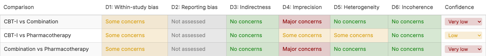
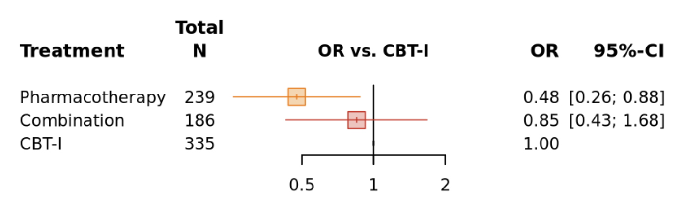
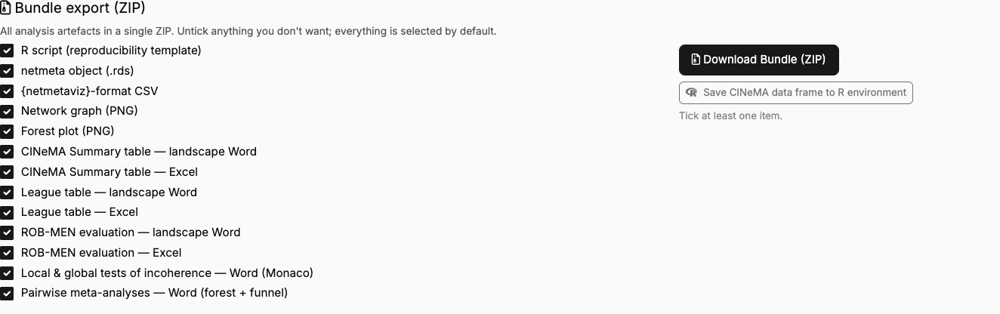

[Manual home](README.md) › Report and export

# 10. The Report tab and export

The **Report** tab assembles every domain rating into a single confidence table
and a set of publication-ready figures, then lets you export the whole analysis
as a ZIP bundle. This chapter walks through each section from top to bottom.

---

## 10.1 Palette and downgrade algorithm

Two selectors at the top of the tab govern how the report is rendered and how
confidence is computed:

1. **Color palette** (radio): **Pastel** (default) or **Classic**. This controls
   the colour scheme of the traffic-light table, the network graph edges, and the
   league table.
2. **Downgrade algorithm** (dropdown):
   - **① Standard** — Some = −1, Major = −2; Domains 4/5/6 are anti-double-counted
     as a single group. (Default.)
   - **② Fractional** — Some = −1/3, Major = −1, summed across all domains and
     rounded.

The downgrade algorithm determines the **suggested** confidence rating shown in
the summary table; you can always override it per comparison (Section 10.2).

---

## 10.2 Summary Table



*Figure 10.1 — The CINeMA summary table. Each row is a comparison; the six domain
columns are colour-coded, and the Confidence column is editable.*

The **Summary Table** is the CINeMA traffic-light grid: one row per comparison,
with colour-coded cells for Domains 1–6 (D1 Within-study bias, D2 Reporting bias,
D3 Indirectness, D4 Imprecision, D5 Heterogeneity, D6 Incoherence).

- **Setting confidence.** Click a cell in the **Confidence** column to set the
  confidence level — **High**, **Moderate**, **Low**, or **Very low**. If left
  unset, the cell falls back to the algorithm's *suggested* confidence.
- **Row order.** Rows are shown in the analysis's default order: **mixed evidence
  first, then indirect-only**. Use the Excel export (Section 10.6) for offline
  reordering.

---

## 10.3 Network Graph


*Figure 10.2 — The network graph. The "Display options" disclosure exposes node
sizing, edge thickness, edge colour, rotation, and labelling controls.*

Open **Display options** to customise the graph:

- **Node sizing** — By total sample size (default) / By number of studies / Equal.
- **Edge thickness** — By number of trials (default) / Inverse variance / Equal.
- **Treatment order (around circle)** — Optimal (minimise crossings) / Alphabetic.
- **Edge colour** — CINeMA confidence (default) / Within-study bias (Domain 1) /
  Monochrome.
- **Rotation (°)** — a slider from −180 to 180.
- **Edge-label position** — where the *n*-studies label sits along each edge.
- Checkboxes: **Show treatment labels**, **Show n-studies on edges**, and a
  **Plot height (px)** slider.

---

## 10.4 Forest Plot



*Figure 10.3 — The forest plot is canonical `netmeta::forest()` output; the
display options control the reference, sort order, axis, and appearance.*

Open **Display options** to customise the forest plot:

- **Reference** — the treatment all others are compared against.
- **Sort order** — P-score / ▲ P-score / **CINeMA category (High+Moderate first),
  then P-score** (`cinema_pscore`) / By point estimate / Alphabetic.
- **x min / x max** — leave blank for auto axis limits.
- **Log x-axis (OR/RR)** — checkbox (on by default for ratio measures).
- **Show k (number of studies) column**, **Show total N column**, **Show
  heterogeneity row (tau², I²)** — checkboxes.
- **Font size (pt)** — a slider from 5 to 18.
- **Favours left / Favours right** — free-text axis labels.

---

## 10.5 League Table

The **League Table** shows the NMA estimate [95% CI] for each column-vs-row
treatment in the lower-left triangle, with each cell coloured by CINeMA
confidence. A **Sort treatments by** control offers **Alphabetic**, **P-score**,
or **▲ P-score** ordering.

---

## 10.6 Export



*Figure 10.4 — The bundle-export section. Every item is selected by default;
untick anything you do not want, then click **Download Bundle (ZIP)**.*

The **Bundle export (ZIP)** collects every analysis artefact into a single ZIP.
The checklist (all ticked by default) contains:

| Item | Description |
| --- | --- |
| R script (reproducibility template) | Script that reloads the bundled netmeta object and regenerates the figures. |
| netmeta object (.rds) | The fitted `netmeta` object. |
| {netmetaviz}-format CSV | The CINeMA ratings in netmetaviz-compatible layout (see Section 10.7). |
| Network graph (PNG) | The network graph as configured above. |
| Forest plot (PNG) | The forest plot as configured above. |
| CINeMA Summary table — landscape Word | The traffic-light summary as a Word document. |
| CINeMA Summary table — Excel | The same summary as a spreadsheet. |
| League table — landscape Word | The league table as a Word document. |
| League table — Excel | The league table as a spreadsheet. |
| ROB-MEN evaluation — landscape Word | The ROB-MEN tables as a Word document. |
| ROB-MEN evaluation — Excel | The ROB-MEN tables as a spreadsheet. |
| Local & global tests of incoherence — Word | Node-splitting and global inconsistency tests. |
| Pairwise meta-analyses — Word | Per-comparison forest and funnel plots. |

Click **Download Bundle (ZIP)** to save the selected items (at least one must be
ticked; the file is named `nmatools_bundle_<date>.zip`).

Beneath it, **Save CINeMA data frame to R environment** assigns the CINeMA
ratings data frame to `cinema_results` in your R global environment, so you can
continue working with it at the console:

```r
cinema_results   # the CINeMA ratings data frame, saved from the GUI
```

---

## 10.7 Bridge to the scripted visualisation functions

The exported **{netmetaviz}-format CSV** (columns: `Comparison`, `Number of
studies`, the six domain ratings, `Confidence rating`, and `Reason(s) for
downgrading`) is exactly the input the scripted colouring functions expect. You
can feed it to:

- `color_league()` — colour a league table by CINeMA confidence
  (see [Chapter 11](11-league-tables.md));
- `color_forest()` — colour forest-plot CI squares by CINeMA confidence
  (see [Chapter 12](12-colored-forest-netgraph.md));
- `color_netgraph()` — colour network-graph edges by CINeMA confidence
  (see [Chapter 12](12-colored-forest-netgraph.md)).

This lets you build the GUI's assessment interactively, then reproduce
publication figures from a script:

```r
color_league(x = net, cinema = "cinema_netmetaviz_<date>.csv", file = "league.xlsx")
```

---

## 10.8 Recommended Citations

The tab closes with a **Recommended Citations** panel:

1. Nikolakopoulou A, Higgins JPT, Papakonstantinou T, et al. CINeMA: An approach
   for assessing confidence in the results of a network meta-analysis. *PLoS
   Med.* 2020;17(4):e1003082.
   [doi:10.1371/journal.pmed.1003082](https://doi.org/10.1371/journal.pmed.1003082)
2. Chiocchia V, Nikolakopoulou A, Higgins JPT, et al. ROB-MEN: a tool to assess
   risk of bias due to missing evidence in network meta-analysis. *BMC Med.*
   2021;19(1):304.
   [doi:10.1186/s12916-021-02166-3](https://doi.org/10.1186/s12916-021-02166-3)

---

Prev: [9. ROB-MEN](09-gui-robmen.md) · Next: [11. League tables](11-league-tables.md)
