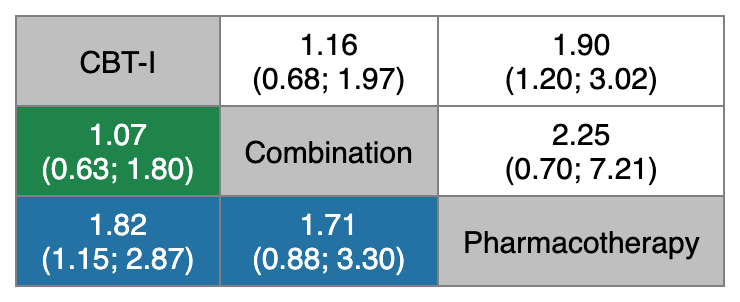
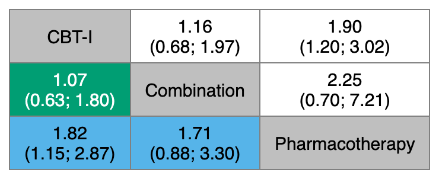
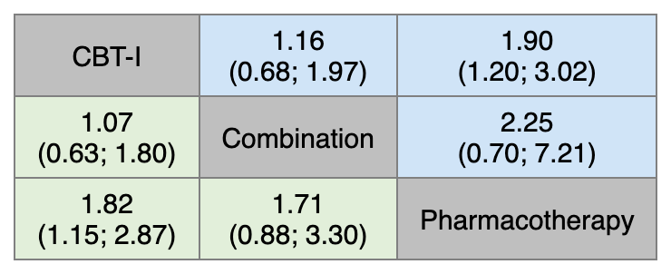
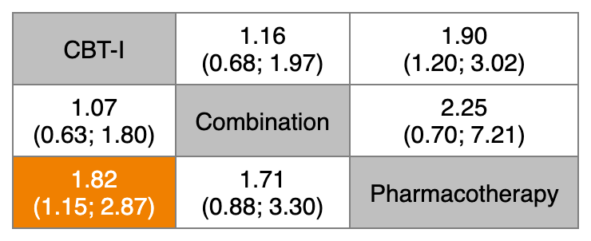
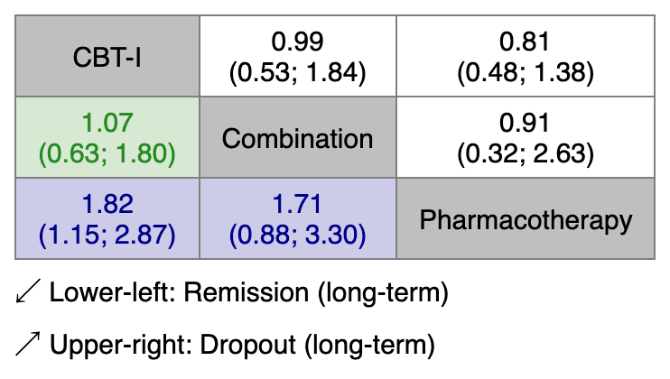
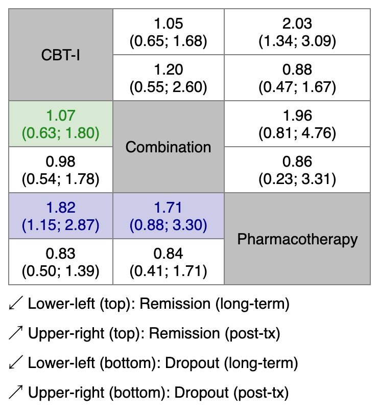
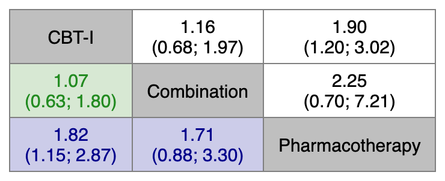

[Manual home](README.md) › Colored league tables

# 11. Colored league tables — `color_league()` and `color_league_multi()`

A league table is the standard way to present every pairwise contrast in a
network meta-analysis in a single square matrix. `nmatools` renders league
tables to Excel (`.xlsx`) and colors each cell so that the confidence in — or
the clinical importance of — every comparison is visible at a glance.

Two functions are covered in this chapter:

| Function | Output | Typical use |
|---|---|---|
| `color_league()` | one `.xlsx` sheet | a single outcome, or up to four outcomes packed into one sheet |
| `color_league_multi()` | one `.xlsx` workbook, one sheet per outcome | several outcomes side by side |

All examples build the `netmeta` objects from the bundled W2I insomnia data
(three treatments: CBT-I, Combination, Pharmacotherapy; four binary outcomes on
the odds-ratio scale). CINeMA confidence ratings are bundled for the
`remission_lt` outcome only.

```r
library(nmatools)

# Fitted netmeta objects for the four bundled outcomes
net_lt  <- build_w2i_netmeta("remission_lt")   # long-term remission
net_dlt <- build_w2i_netmeta("dropout_lt")     # long-term dropout
net_pt  <- build_w2i_netmeta("remission_pt")   # post-treatment remission
net_dpt <- build_w2i_netmeta("dropout_pt")     # post-treatment dropout

# Path to the bundled CINeMA CSV (remission_lt only)
cinema_path <- w2i_cinema_path()
```

## 11.1 Basic call

The minimal call supplies a `netmeta` object, a CINeMA source, and an output
path. With the default `palette_type = "pastel"`, each off-diagonal cell is
tinted according to the CINeMA confidence rating of that comparison, and the
cell text shows the odds ratio with its 95% confidence interval.

```r
color_league(
  x       = net_lt,
  cinema  = cinema_path,
  sort_by = "alphabet",
  file    = "color_league_alphabet.xlsx"
)
```


*The default pastel league table. Diagonal cells (gray) carry the treatment
names; each off-diagonal cell holds the odds ratio and its 95% CI, tinted by
the CINeMA confidence rating of the comparison against the row/column
treatment.*

How to read the table:

- **Diagonal cells** show the treatment names on a gray background
  (`header_bg = "#BFBFBF"`).
- **Off-diagonal cells** give the pooled effect estimate and 95% CI. By
  default the CI is wrapped onto a second line (`wrap_ci = TRUE`), the opening
  bracket is `"("`, and the bound separator is `" to "`. Estimates are shown to
  `digits = 2` decimal places.
- **Cell color** encodes the CINeMA confidence rating for that comparison
  (very low / low / moderate / high). Comparisons without a rating are left
  uncolored.
- The **reference convention** follows `netmeta`: the comparison direction is
  read row versus column, so the estimate in a cell is the effect of the column
  treatment relative to the row treatment (or vice versa, depending on
  orientation). Because CINeMA ratings are attached by matching both `"A:B"`
  and `"B:A"` comparison labels, the direction of the label in the CINeMA file
  does not matter.

CINeMA input may be either the path to a CSV exported from the
[CINeMA web tool](https://cinema.ispm.unibe.ch/), or a data frame with columns
`"Comparison"` and `"Confidence rating"`.

## 11.2 Sorting the treatments

The row/column order is controlled by `sort_by`:

| `sort_by` | Order |
|---|---|
| `"alphabet"` (default) | alphabetical by treatment name |
| `"pscore"` | by P-score (netmeta ranking), best first |
| `"es"` | by effect size |
| `"es_rev"` | by effect size, reversed |
| `"pvalue"` | by p-value versus reference |
| `"zscore"` | by z-score |
| `"custom"` | the exact order given in `sort_order` |

```r
# Rank the treatments by P-score
color_league(
  x       = net_lt,
  cinema  = cinema_path,
  sort_by = "pscore",
  file    = "color_league_pscore.xlsx"
)

# Fully explicit order
color_league(
  x          = net_lt,
  cinema     = cinema_path,
  sort_by    = "custom",
  sort_order = c("CBT-I", "Combination", "Pharmacotherapy"),
  file       = "color_league_custom.xlsx"
)
```


*The same table sorted by P-score, so the best-ranked treatment appears in the
top-left corner. In the demo network the P-score ranking (CBT-I, Combination,
Pharmacotherapy) happens to coincide with the alphabetical default, so this
render looks identical to the previous one; with more treatments the two
orderings usually differ.*

## 11.3 Palettes

`palette_type` selects the coloring scheme:

| `palette_type` | Behavior |
|---|---|
| `"pastel"` (default) | CINeMA confidence ratings, pastel backgrounds |
| `"classic"` | CINeMA confidence ratings, vivid backgrounds with white text |
| `"colorblind"` | CINeMA confidence ratings, Okabe–Ito palette |
| `"solid"` | a single fill color across all off-diagonal cells (CINeMA not used) |
| `"SchneiderThoma2026"` | categorical coloring by CI versus a trivial range (CINeMA not used); requires `trivial_range` |

```r
# Classic (vivid, white text — common in published NMAs)
color_league(x = net_lt, cinema = cinema_path,
             palette_type = "classic", file = "color_league_classic.xlsx")

# Colorblind-safe (Okabe–Ito)
color_league(x = net_lt, cinema = cinema_path,
             palette_type = "colorblind", file = "color_league_colorblind.xlsx")

# Solid fill (no CINeMA); fill_color sets the single cell color
color_league(x = net_lt, sort_by = "pscore", palette_type = "solid",
             fill_color = "#E2EFDA", file = "color_league_solid.xlsx")
```

You may also pass a palette list directly through `palette =`
(the legacy interface); `cinema_palette("classic")` returns such a list.



*Classic palette: saturated backgrounds with white text.*



*Colorblind-safe palette based on the Okabe–Ito colors.*



*Solid fill: every off-diagonal cell uses one color (`fill_color`, here light
green). Useful when you want a uniform frame with no evidence-based coloring.*

### Schneider-Thoma 2026 palette

The `"SchneiderThoma2026"` palette colors cells categorically by comparing the
95% CI to a user-defined **trivial range** rather than by CINeMA rating. It
requires `trivial_range` and does not use CINeMA data (any `cinema` argument is
silently ignored).

```r
color_league(
  x             = net_lt,
  sort_by       = "pscore",
  palette_type  = "SchneiderThoma2026",
  trivial_range = log(c(1/1.1, 1.1)),   # OR 0.91–1.10 treated as trivial
  file          = "color_league_st2026.xlsx"
)
```



*Schneider-Thoma 2026 categorical coloring of the league table.*

The four cell colors follow this scheme:

| Color | Condition |
|---|---|
| Blue (`#4E88B4`) | the entire 95% CI lies within the trivial zone (clinically trivial) |
| Yellow (`#FFD700`) | the point estimate is beyond the trivial zone but the CI still overlaps it |
| Orange (`#F08000`) | the point estimate **and** the whole 95% CI lie beyond the trivial zone (statistically significant, beneficial or harmful) |
| White | all other cases (near-null or non-significant) |

> **Pitfall — `trivial_range` is scale-dependent.** For ratio measures
> (OR, RR, HR) the effect estimates live on the **log** scale, so
> `trivial_range` must also be given on the log scale:
> `log(c(1/1.1, 1.1))` corresponds to odds ratios of roughly 0.91 to 1.10. For
> mean differences (MD, SMD) the estimates are already on the raw scale, so
> pass the trivial range directly, e.g. `c(-0.2, 0.2)`. Passing a raw ratio
> range (such as `c(0.91, 1.10)`) to an OR outcome will mis-color every cell.

## 11.4 Multiple outcomes in one sheet

`color_league()` can pack two or four outcomes into a single table.

**Dual outcome (`x2`).** The lower-left triangle shows outcome 1 (`x`); the
upper-right triangle shows outcome 2 (`x2`). Attach a separate CINeMA file per
outcome with `cinema` / `cinema2`. The outcome labels are written below the
table as note rows merged across the full table width, recording which outcome
fills which triangle without distorting the column widths.

```r
color_league(
  x       = net_lt,
  cinema  = cinema_path,
  x2      = net_dlt,
  label1  = "Remission (long-term)",
  label2  = "Dropout (long-term)",
  sort_by = "pscore",
  file    = "color_league_dual_lt.xlsx"
)
```



*Dual-outcome mode: remission (lower-left) and dropout (upper-right) share one
table, split along the diagonal.*

**Quad outcome (`x3`, `x4`).** Supplying `x3` and/or `x4` activates
quad-outcome mode. Each off-diagonal cell is split into a top and bottom
sub-row (so each Excel data row becomes two), and the diagonal cells are merged
vertically to hold the treatment name. The four outcomes map to the sub-rows
as follows:

- lower-left, top → `x` (outcome 1)
- lower-left, bottom → `x3` (outcome 3)
- upper-right, top → `x2` (outcome 2)
- upper-right, bottom → `x4` (outcome 4)

```r
color_league(
  x       = net_lt,
  cinema  = cinema_path,
  x2      = net_pt,
  x3      = net_dlt,
  x4      = net_dpt,
  label1  = "Remission (long-term)",
  label2  = "Remission (post-tx)",
  label3  = "Dropout (long-term)",
  label4  = "Dropout (post-tx)",
  sort_by = "pscore",
  file    = "color_league_quad.xlsx"
)
```



*Quad-outcome mode: four outcomes in one table, each off-diagonal cell split
into two sub-rows, with the four outcome labels as caption lines below the
table.*

Per-outcome CINeMA files are available for all layouts via `cinema2`,
`cinema3`, and `cinema4`. In solid mode, `fill_color` through `fill_color4`
color each outcome's cells independently.

## 11.5 One workbook, one sheet per outcome

`color_league_multi()` writes a multi-sheet workbook — one league table per
outcome, each on its own sheet. `outcomes` is a **named** list (the names
become Excel sheet names, truncated to 31 characters). `cinema` may be `NULL`
(no CINeMA anywhere), a single source applied to every sheet, or a named list
matching `outcomes` (use `NULL` for outcomes without a CINeMA file).

```r
color_league_multi(
  outcomes = list(
    "Remission (LT)" = net_lt,
    "Dropout (LT)"   = net_dlt,
    "Remission (PT)" = net_pt,
    "Dropout (PT)"   = net_dpt
  ),
  cinema = list(
    "Remission (LT)" = cinema_path,
    "Dropout (LT)"   = NULL,
    "Remission (PT)" = NULL,
    "Dropout (PT)"   = NULL
  ),
  sort_by = "pscore",
  file    = "color_league_4outcomes.xlsx"
)
```



*First sheet of the multi-sheet workbook produced by `color_league_multi()`.
Each outcome occupies its own tab. Because sheet 1 holds the same outcome,
CINeMA file, and sort order as the single-outcome examples above, this render
looks identical to them — the difference lives in the workbook's other tabs.*

All shared arguments (`sort_by`, `sort_order`, `palette_type`,
`trivial_range`, `digits`, and so on) are forwarded to every sheet, so a single
call can, for example, render four Schneider-Thoma-colored tables with one
`trivial_range`.

## 11.6 Output and opening the file

Both functions write an `.xlsx` file to the path given in `file` and invisibly
return the underlying `openxlsx` workbook object. Open the file in Excel,
LibreOffice Calc, or Google Sheets. For `color_league()` there is a single
worksheet; for `color_league_multi()` there is one worksheet per outcome, each
named after the corresponding list entry. Note rows beneath each table record
the outcome labels supplied via `label1`–`label4`; each note is merged across
the full table width, so auto-fitting columns leaves the grid balanced.

---

Prev: [10. GUI report and export](10-gui-report-export.md) · Next: [12. Colored forest and network graphs](12-colored-forest-netgraph.md)
