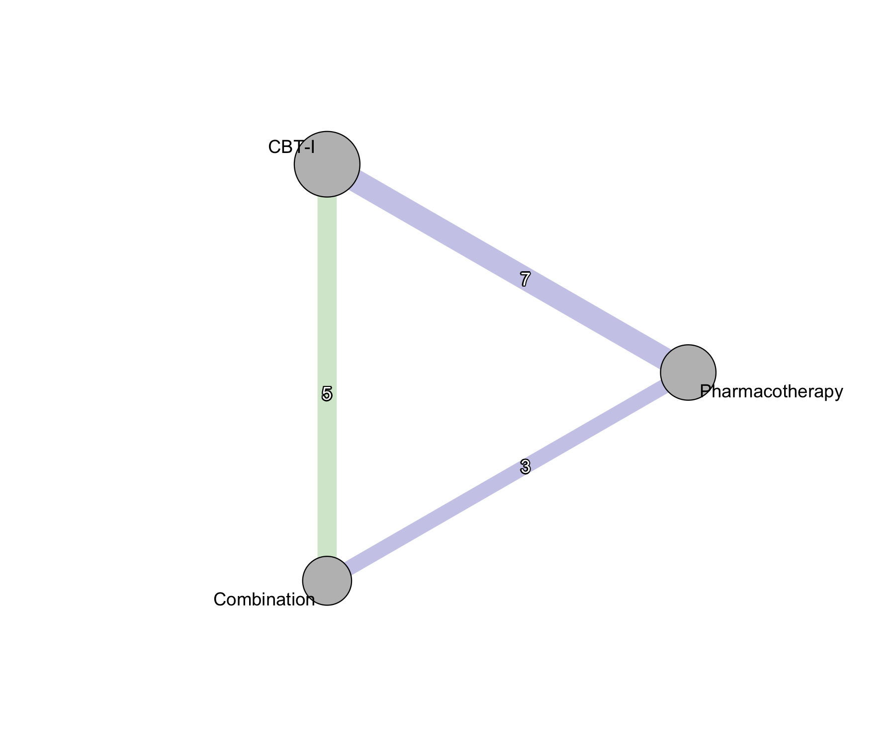
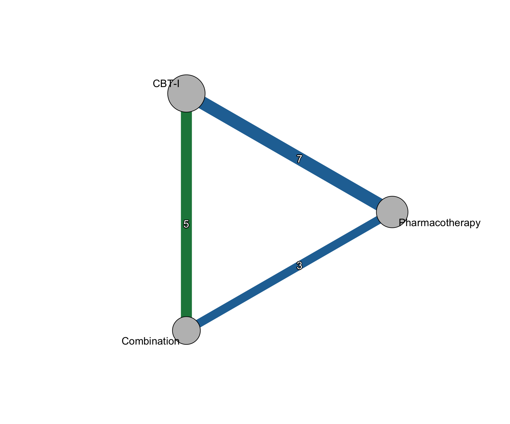
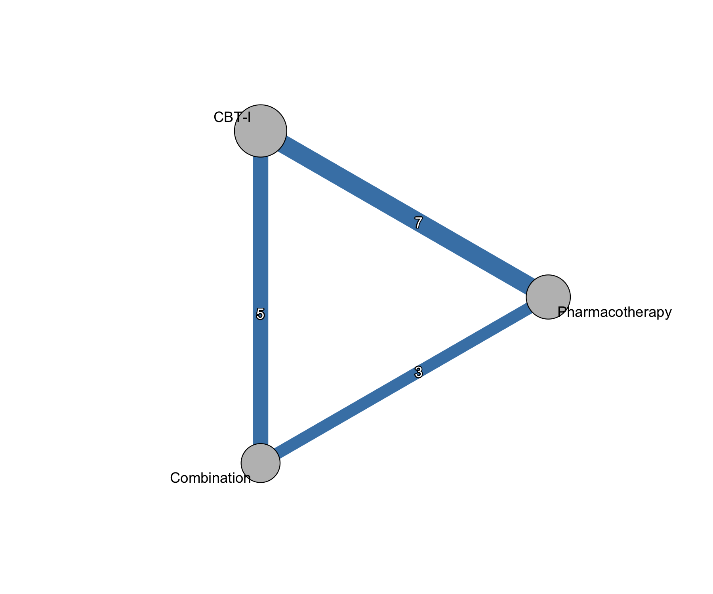

[Manual home](README.md) › Colored forest and network graphs

# 12. Colored forest and network graphs — `color_forest()` and `color_netgraph()`

Two plotting wrappers add CINeMA confidence coloring to the two most common
network meta-analysis figures. `color_forest()` colors the confidence-interval
squares of a forest plot; `color_netgraph()` colors the edges of the network
graph. Both are thin wrappers around the corresponding `netmeta` functions and
forward everything they do not consume through `...`, so any argument accepted
by `forest.netmeta()` or `netgraph()` remains available.

```r
library(nmatools)

net_lt      <- build_w2i_netmeta("remission_lt")   # long-term remission (OR)
cinema_path <- w2i_cinema_path()                   # bundled CINeMA CSV
```

## 12.1 `color_forest()` — confidence-colored forest plot

`color_forest()` draws a forest plot of every treatment versus the reference
and fills each CI square with the color of that comparison's CINeMA confidence
rating.

```r
color_forest(
  x               = net_lt,
  cinema          = cinema_path,
  reference.group = "Pharmacotherapy"
)
```


*Forest plot versus the reference treatment. Each CI square is filled by the
CINeMA confidence rating of the corresponding comparison; treatments without a
rating fall back to `col_no_cinema`.*

### Arguments

| Argument | Default | Purpose |
|---|---|---|
| `x` | — | a `netmeta` object |
| `cinema` | — | CINeMA CSV path, or a data frame with `"Comparison"` and `"Confidence rating"` columns |
| `reference.group` | `x$reference.group` | reference used both for the CINeMA look-up and as `forest()`'s reference |
| `palette` | `NULL` | a palette list (see `cinema_palette()`); overrides `palette_type` |
| `palette_type` | `"pastel"` | one of `"pastel"`, `"classic"`, `"colorblind"` |
| `col_no_cinema` | `"grey80"` | fill color for treatments with no CINeMA rating |
| `...` | — | forwarded verbatim to `netmeta::forest()` |

Internally the function computes three arguments from the CINeMA ratings —
`col.square` (square fill), `col.square.lines` (square border), and
`col.study` (treatment-label color) — but only when you have not supplied them
yourself. **User-supplied values always win.** Passing `col.square` explicitly,
for example, overrides the CINeMA-derived colors entirely.

Colors are assigned in `x$trts` order, excluding the reference — this is the
default row order `forest.netmeta()` uses. If you reorder rows with `sortvar`
through `...`, make sure the row order still matches the color vector.

Because the extra arguments pass straight through, the usual `forest()`
customizations work unchanged:

```r
# interface example — not runnable as-is
color_forest(
  x               = net_lt,
  cinema          = cinema_path,
  reference.group = "Pharmacotherapy",
  leftcols        = c("studlab", "n.trts"),
  xlim            = c(0.2, 5),
  smlab           = "Long-term remission (OR)"
)
```

## 12.2 `color_netgraph()` — confidence-colored network graph

`color_netgraph()` draws the network graph and colors each edge (direct
comparison) by its CINeMA confidence rating. Node size is proportional to the
total number of participants in trials that include each treatment. When no
CINeMA data are supplied — or a specific comparison has no rating — the edge
falls back to `col_no_cinema`.

```r
# Default: pastel palette, node size proportional to N
color_netgraph(x = net_lt, cinema = cinema_path)

# Classic palette
color_netgraph(x = net_lt, cinema = cinema_path, palette_type = "classic")

# No CINeMA: every edge takes a single fallback color
color_netgraph(x = net_lt, col_no_cinema = "steelblue")
```



*Pastel palette. The CBT-I–Combination edge is green (higher confidence); edges
to Pharmacotherapy are lavender. Edge labels are the number of studies
contributing to each direct comparison (7, 5, 3).*



*The same network with the classic (vivid) palette.*



*With no CINeMA data supplied, every edge falls back to `col_no_cinema` (here
`steelblue`). Node size still reflects participant counts.*

### Arguments

| Argument | Default | Purpose |
|---|---|---|
| `x` | — | a `netmeta` object |
| `cinema` | `NULL` | CINeMA source; `NULL` colors every edge with `col_no_cinema` |
| `palette` | `NULL` | a palette list; overrides `palette_type` |
| `palette_type` | `"pastel"` | one of `"pastel"`, `"classic"`, `"colorblind"` |
| `col_no_cinema` | `"grey60"` | edge color for comparisons without a rating |
| `...` | — | forwarded to `netmeta::netgraph()` |

The wrapper applies several `netgraph()` defaults, each overridable through
`...`: `plastic = FALSE`, `points = TRUE`, `pch = 21`,
`col.points = "black"`, `bg.points = "gray"`,
`thickness = "number.of.studies"`, `multiarm = FALSE`,
`number.of.studies = TRUE`, and `pos.number.of.studies = 0.45`. Node size
(`cex.points`) defaults to a per-treatment participant total computed from
`x$data`; supply `cex.points` yourself to override it.

> **Gotcha — do not pass `xlim`/`ylim` through `...`.** `netgraph()` sets the
> plot limits internally to fit the node layout it computes. Overriding `xlim`
> or `ylim` fights that layout and typically clips nodes or labels off the edge
> of the device. If you need more room around the graph — for example so long
> treatment labels are not cut off — use `netgraph()`'s own `scale =` argument
> to zoom out instead:
>
> ```r
> # interface example — not runnable as-is
> color_netgraph(x = net_lt, cinema = cinema_path, scale = 1.3)
> ```

## 12.3 Palette helpers — `cinema_palette()` and `pval_palette()`

Both plotting functions accept a `palette` list directly. Two exported helpers
return the built-in palettes.

**`cinema_palette(type)`** returns the CINeMA confidence palette as a named
list mapping each rating (`"very low"`, `"low"`, `"moderate"`, `"high"`) to a
`list(bg = ..., color = ...)` pair — `bg` is the fill color (the CI square or
edge color) and `color` is the matching text color. `type` is one of
`"pastel"` (default), `"classic"`, or `"colorblind"`. Pass the result as
`palette =` when you want to hand-tune a scheme or reuse the exact same colors
across a forest plot, a network graph, and a league table.

```r
pal <- cinema_palette("classic")
color_forest(net_lt, cinema = cinema_path, palette = pal)
color_netgraph(net_lt, cinema = cinema_path, palette = pal)
```

**`pval_palette(name)`** returns the diverging **signed-p-value** gradient used
by the Kilim and Vitruvian plots (Chapter 13), not by the two functions in this
chapter. It returns a list with `$neutral`, `$green`, and `$red`, each an
`R, G, B` triple (0–255). `name` is `"GrYlRd"` (default; green–yellow–red) or
`"GrRd"` (green–white–red). Reach for it when you want to reproduce those plots'
color logic in a custom figure.

---

Prev: [11. Colored league tables](11-league-tables.md) · Next: [13. Kilim and Vitruvian plots](13-kilim-vitruvian.md)
