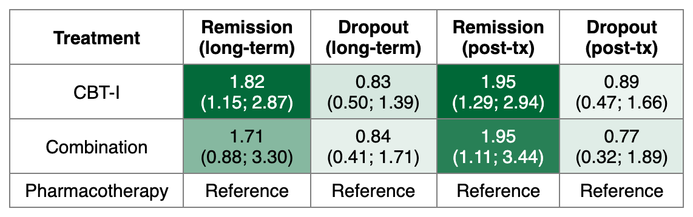
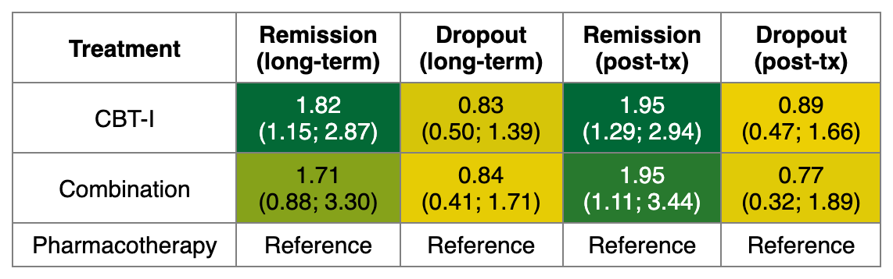
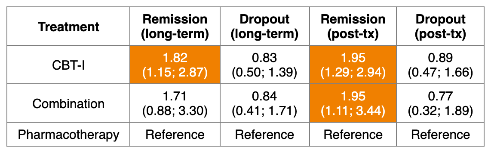
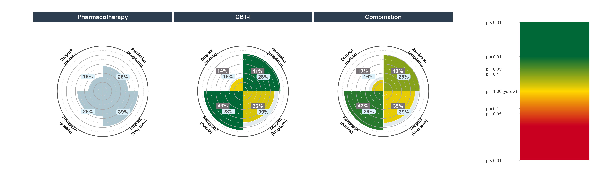
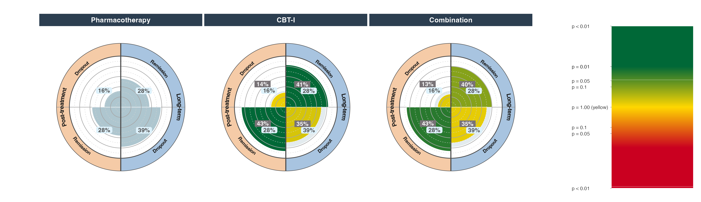

[Manual home](README.md) › Kilim and Vitruvian plots

# 13. Kilim and Vitruvian plots — `kilim()` and `vitruvian()`

Both functions summarize a network meta-analysis across **several outcomes at
once**. The Kilim plot (Seo et al. 2021) is a colored table — treatments in
rows, outcomes in columns — with cells shaded by the signed p-value of each
treatment versus a reference. The Vitruvian plot (Ostinelli et al. 2022) is a
set of per-treatment polar charts showing **absolute** effects, one spoke per
outcome.

Both take a common `outcomes` argument: a list in which each element is itself a
list describing one outcome (its `netmeta` object, reference, direction of
benefit, label, and so on).

```r
library(nmatools)

net_lt  <- build_w2i_netmeta("remission_lt")   # long-term remission (OR)
net_dlt <- build_w2i_netmeta("dropout_lt")     # long-term dropout (OR)
net_pt  <- build_w2i_netmeta("remission_pt")   # post-treatment remission (OR)
net_dpt <- build_w2i_netmeta("dropout_pt")     # post-treatment dropout (OR)
```

## 13.1 `kilim()` — multi-outcome signed-p-value table

Each cell of the Kilim table holds the effect estimate (with CI, by default)
and is colored by the signed p-value of that treatment versus the reference:
green for a beneficial effect, red for a harmful one, and — when a
`trivial_range` is given — steel blue for an effect that falls inside the
trivial zone. Reference cells are left uncolored. The output is an `.xlsx`
file.

### Outcome specifications

Each element of `outcomes` is a list with these fields:

| Field | Meaning |
|---|---|
| `x` | a `netmeta` object, or a character path to an `.rds` file holding one |
| `name` | internal outcome name (used to build column names) |
| `reference` | reference treatment name |
| `small_values` | `"desirable"` (lower is better, e.g. dropout) or `"undesirable"` (higher is better, e.g. remission) |
| `digits` | decimal places (default 2) |
| `label` | column header text (`\n` inserts a line break) |
| `trivial_range` | optional per-outcome trivial range; overrides the top-level value |

```r
kilim(
  outcomes = list(
    list(x = net_lt,  name = "remission_lt", reference = "Pharmacotherapy",
         small_values = "undesirable", label = "Remission\n(long-term)", digits = 2),
    list(x = net_dlt, name = "dropout_lt",   reference = "Pharmacotherapy",
         small_values = "desirable",  label = "Dropout\n(long-term)",   digits = 2),
    list(x = net_pt,  name = "remission_pt", reference = "Pharmacotherapy",
         small_values = "undesirable", label = "Remission\n(post-tx)",   digits = 2),
    list(x = net_dpt, name = "dropout_pt",   reference = "Pharmacotherapy",
         small_values = "desirable",  label = "Dropout\n(post-tx)",     digits = 2)
  ),
  sort_by = "pscore",
  file    = "kilim_4outcomes.xlsx"
)
```



*Four-outcome Kilim table with the default GrRd (green–white–red) gradient.
The Pharmacotherapy reference row is uncolored; other cells are shaded by the
signed p-value against Pharmacotherapy for each outcome.*

### Palettes

`palette` accepts three schemes:

| `palette` | Behavior |
|---|---|
| `"GrRd"` (default) | green / white / red continuous gradient over the signed p-value; recommended for Excel output |
| `"GrYlRd"` | green / yellow / red continuous gradient |
| `"SchneiderThoma2026"` | categorical 4-color scheme based on the 95% CI versus `trivial_range` (requires `trivial_range`) |

```r
# GrYlRd gradient
kilim(outcomes = my_outcomes, palette = "GrYlRd", sort_by = "pscore",
      file = "kilim_gryrd.xlsx")   # interface example — reuse the outcomes list above

# Schneider-Thoma 2026 categorical coloring (trivial_range required, log scale for OR)
kilim(
  outcomes      = my_outcomes,
  trivial_range = log(c(1/1.1, 1.1)),
  palette       = "SchneiderThoma2026",
  sort_by       = "pscore",
  file          = "kilim_st2026.xlsx"
)   # interface example — reuse the outcomes list above
```



*The same table with the GrYlRd (green–yellow–red) gradient.*



*Schneider-Thoma 2026 categorical coloring, driven by the relationship between
each 95% CI and the trivial range.*

> **`trivial_range` is scale-dependent.** For ratio measures (OR, RR, HR) the
> range is on the **log** scale, e.g. `log(c(1/1.1, 1.1))` for odds ratios of
> 0.91 to 1.10. For MD/SMD it is on the raw scale. A `trivial_range` may be set
> once at the top level (applied to every outcome) or overridden per outcome by
> putting `trivial_range` inside that outcome's list.

### Output

`kilim()` writes an `.xlsx` file (the `file` path must end in `.xlsx`) and
invisibly returns the `openxlsx` workbook object. The package README also
documents `.docx` output for the same table content.

## 13.2 `vitruvian()` — per-treatment polar chart of absolute effects

`vitruvian()` renders one polar (spider) chart per treatment. Each spoke is one
outcome; the bar height is the **absolute** effect (an event rate for binary
outcomes), and the bar color is the signed-p-value gradient. The reference
treatment is drawn in gray-blue, and a semi-transparent overlay of the
reference rate is drawn on every other treatment's chart for comparison.

The `outcomes` structure mirrors `kilim()`, with a few extra fields:

| Field | Meaning |
|---|---|
| `cer` | control event rate (0–1) for binary outcomes; the reference-arm rate used to turn the odds ratio into an absolute risk |
| `group` | optional group name; outcomes sharing a group get a shared outer-ring color and an arc label |
| `pooled_sd` | pooled SD, used only for `sm = "MD"` continuous outcomes |
| `trivial_range` | optional per-outcome trivial range |

Unlike `kilim()`, `reference` is a top-level argument of `vitruvian()` (though
an individual outcome may override it in its own list).

### Basic call

The `cer` values below are the published Pharmacotherapy reference event rates
for the W2I data: long-term remission 0.28, long-term dropout 0.39,
post-treatment remission 0.28, post-treatment dropout 0.16.

```r
vitruvian(
  outcomes = list(
    list(x = net_lt,  name = "remission_lt", label = "Remission",
         small_values = "undesirable", cer = 0.28, group = "Long-term"),
    list(x = net_dlt, name = "dropout_lt",   label = "Dropout",
         small_values = "desirable",  cer = 0.39, group = "Long-term"),
    list(x = net_pt,  name = "remission_pt", label = "Remission",
         small_values = "undesirable", cer = 0.28, group = "Post-treatment"),
    list(x = net_dpt, name = "dropout_pt",   label = "Dropout",
         small_values = "desirable",  cer = 0.16, group = "Post-treatment")
  ),
  reference = "Pharmacotherapy",
  digits    = 1,
  ncol      = 3
)
```



*One polar panel per treatment (Pharmacotherapy, CBT-I, Combination). Each of
the four wedges is one outcome, drawn at its absolute-risk value; the p-value
color legend on the right runs from green (p < 0.01) through yellow (p = 1) to
red.*

If `cer` is omitted, the reference event rate is estimated automatically —
`cer = "metaprop"` uses `meta::metaprop()` (a GLMM), and `cer = "simple"` uses
a plain average. Supplying numeric `cer` values keeps the printed numbers
identical to the source publication. When `width`/`height` are omitted they are
computed from `ncol` and the number of treatments (each panel is 4×4 inches).

### Trivial range and grouping

```r
vitruvian(
  outcomes      = my_binary_outcomes,       # interface example — reuse the list above
  reference     = "Pharmacotherapy",
  trivial_range = log(c(1/1.1, 1.1)),        # OR 0.91–1.10 shaded steel blue
  digits        = 1,
  ncol          = 3,
  file          = "vitruvian_4outcomes_trivial.png"
)
```


*The same charts with `trivial_range` set: bars whose point estimate falls
inside the trivial zone are drawn in steel blue.*



*With `group =` set on each outcome, spokes from the same construct share an
outer-ring color and an arc label (here "Long-term" and "Post-treatment").*

### Continuous outcomes and mixed charts

Binary and continuous outcomes can share one chart. For a continuous outcome,
supplying a numeric `cer` converts the effect to the same absolute-risk scale
as the binary spokes via the SMD approximation `lnOR = pi / sqrt(3) * SMD`
(Cox & Snell). For `sm = "SMD"` the estimate is treated as an SMD directly; for
`sm = "MD"` it is first divided by `pooled_sd` (supplied, or auto-estimated
from `seTE`, `n1`, and `n2`). Without `cer`, raw MD/SMD values are plotted with
no conversion.

The bundled W2I data has no continuous outcome, so the following is an
interface sketch only:

```r
# interface example — not runnable as-is
vitruvian(
  outcomes = list(
    list(x = net_lt,  name = "remission_lt", label = "Remission",
         small_values = "undesirable", cer = 0.28, group = "Binary"),
    list(x = net_smd, name = "sleep_quality_smd", label = "Sleep quality\n(SMD)",
         small_values = "desirable",  cer = 0.30, group = "Continuous")
    # For an MD outcome, add pooled_sd = 5.2 (or omit for auto-estimation)
  ),
  reference = "Pharmacotherapy",
  digits    = 1,
  ncol      = 2,
  file      = "vitruvian_mixed_smd.png",
  width     = 10,
  height    = 5
)
```

### Output

`vitruvian()` returns a `ggplot` object. If `file` is `NULL` it returns the
object (and, in an interactive session, renders a fixed-size PNG to the RStudio
Viewer so that resizing the window does not reflow the layout). Set `file` to a
path ending in `.png`, `.pdf`, or `.svg` to write to disk.

---

Prev: [12. Colored forest and network graphs](12-colored-forest-netgraph.md) · Next: [14. Evidence frameworks](14-evidence-frameworks.md)
