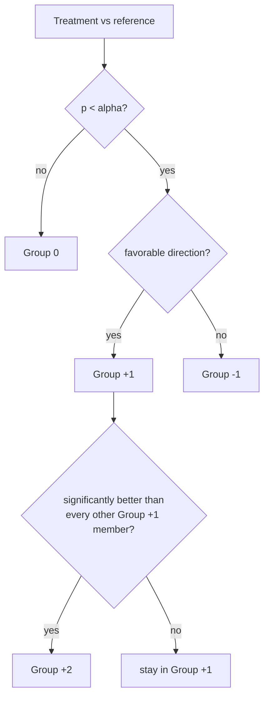
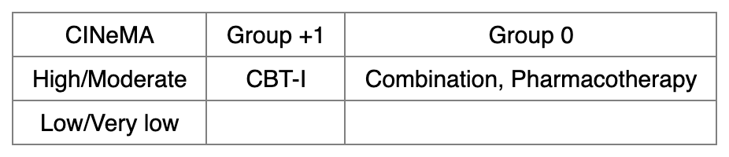
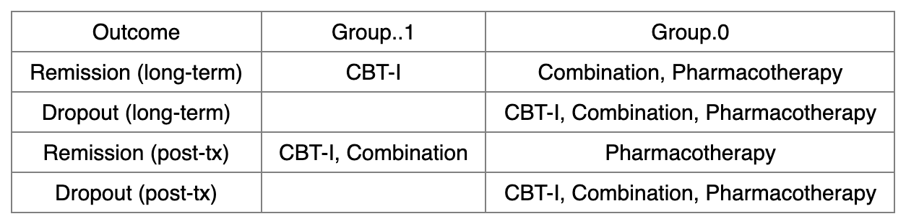
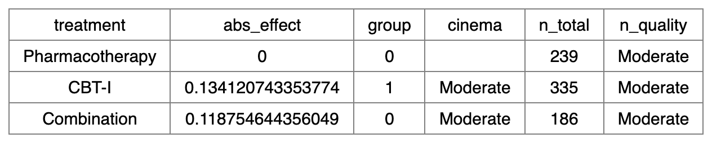

[Manual home](README.md) › Evidence frameworks

# 14. Evidence frameworks — `min_context()` and `part_context()`

GRADE distinguishes two ways of drawing conclusions from a network
meta-analysis. The **minimally contextualized** framework (Tikkinen et al.
2021) ranks treatments purely by statistical comparisons — better than the
reference, better than everything else, no different — without any judgement
about how large a difference matters. The **partially contextualized**
framework (Brignardello-Petersen et al. 2020) instead converts each effect to
an absolute scale and bins it against clinical thresholds that the reviewer
defines. `nmatools` implements both, plus helpers that turn the results into
paste-ready cross-tabulations.

```r
library(nmatools)

net_lt  <- build_w2i_netmeta("remission_lt")   # long-term remission (OR)
net_dlt <- build_w2i_netmeta("dropout_lt")     # long-term dropout (OR)
net_pt  <- build_w2i_netmeta("remission_pt")   # post-treatment remission (OR)
net_dpt <- build_w2i_netmeta("dropout_pt")     # post-treatment dropout (OR)

cinema_path <- w2i_cinema_path()               # bundled CINeMA CSV
```

## 14.1 Minimally contextualized framework — `min_context()`

```r
min_context(
  x,
  cinema       = NULL,
  n_thresholds = c(100, 400),
  reference    = NULL,
  common       = FALSE,
  small_values = "undesirable",
  alpha        = 0.05
)
```

Treatments are placed into ordered groups by their statistical relationship to
the reference and to one another:

- **Group 0** — not significantly different from the reference (p ≥ `alpha`).
- **Group +1** — significantly better than the reference (p < `alpha`, in the
  favorable direction).
- **Group −1** — significantly worse than the reference.
- **Group +2** — the subset of Group +1 that is also significantly better than
  *every other* member of Group +1; these are lifted out of Group +1. The
  process iterates upward (and, symmetrically, downward for Group −2 and below)
  up to ten levels.

The reference treatment is always Group 0. The favorable direction depends on
`small_values`: with `"undesirable"` (the default) a higher effect is better
(e.g. a remission odds ratio above 1); with `"desirable"` a lower effect is
better (e.g. dropout). `alpha` sets the significance threshold (default 0.05).



When `n_thresholds` is supplied (the default `c(100, 400)`), the function adds
an `n_total` column (total participants across all trials that include the
treatment) and an `n_quality` tier derived from it: **Low** below the first
threshold, **Moderate** between them, **High** at or above the second. Set
`n_thresholds = NULL` to drop both columns. When `cinema` is supplied, a
`cinema` column carries the confidence rating for each treatment's comparison
against the reference.

```r
mc_lt <- min_context(
  x            = net_lt,
  cinema       = cinema_path,
  reference    = "Pharmacotherapy",
  small_values = "undesirable"
)
print(mc_lt)
```

The returned data frame (rows sorted by group, descending):

| treatment | group | cinema | n_total | n_quality |
|---|---|---|---|---|
| CBT-I | 1 | Moderate | 335 | Moderate |
| Combination | 0 | Moderate | 186 | Moderate |
| Pharmacotherapy | 0 | `<NA>` | 239 | Moderate |

CBT-I is significantly better than Pharmacotherapy for long-term remission
(Group +1); Combination is not distinguishable from the reference (Group 0).
CINeMA ratings are bundled for `remission_lt` only, so the reference row (which
is not itself a comparison) has no rating.

### Cross-tabulation — `table_min_context()`

`table_min_context(df, quality_col = "cinema", file = NULL)` cross-tabulates
the groups (columns, ordered high to low) against a quality column (rows). Use
`quality_col = "cinema"` for a group-by-confidence table or
`quality_col = "n_quality"` for a group-by-sample-size table. With `file =
NULL` it returns a data frame; give a `.xlsx` or `.docx` path to write the
table out.

```r
tbl_cinema <- table_min_context(mc_lt)                      # Group × CINeMA
tbl_n      <- table_min_context(mc_lt, quality_col = "n_quality")

table_min_context(mc_lt, file = "min_context_remission_lt.xlsx")
```



*`table_min_context()` output: minimally contextualized groups (columns)
against CINeMA confidence (rows).*

### Across outcomes — `table_min_context_multi()`

`table_min_context_multi(outcome_list, sep = "\n", file = NULL)` summarizes
several `min_context()` results in one table: one row per outcome, one column
per group (Group +2, +1, 0, −1, …), with the treatment names in each cell
joined by `sep`. CINeMA and sample-size columns are not broken out here.

```r
mc_dlt <- min_context(net_dlt, reference = "Pharmacotherapy", small_values = "desirable")
mc_pt  <- min_context(net_pt,  reference = "Pharmacotherapy", small_values = "undesirable")
mc_dpt <- min_context(net_dpt, reference = "Pharmacotherapy", small_values = "desirable")

table_min_context_multi(
  outcome_list = list(
    "Remission (long-term)" = mc_lt,
    "Dropout (long-term)"   = mc_dlt,
    "Remission (post-tx)"   = mc_pt,
    "Dropout (post-tx)"     = mc_dpt
  ),
  sep  = ", ",
  file = "min_context_multi.xlsx"
)
```



*`table_min_context_multi()` output: each row is an outcome, each column an
evidence group, cells listing the treatments that fall into that group.*

## 14.2 Partially contextualized framework — `part_context()`

```r
part_context(
  x,
  reference,
  thresholds,
  cer          = NULL,
  outcome_type = NULL,
  small_values = "undesirable",
  common       = FALSE,
  cinema       = NULL,
  n_thresholds = c(100, 400),
  digits       = 2
)
```

Rather than testing significance, this framework asks whether the **absolute**
effect crosses clinically meaningful cut-points that the reviewer supplies in
`thresholds`. Each effect is first converted to an absolute scale:

- **Binary outcomes** (OR/RR): the log effect is turned into an absolute risk
  difference (ARD) against the control event rate `cer`. If `cer` is `NULL` or
  `"metaprop"` it is estimated with `meta::metaprop()`; `"simple"` uses a plain
  average; a numeric value is used as given.
- **Continuous outcomes** (MD/SMD): the estimate is used directly.

`outcome_type` is inferred from `x$sm` when left `NULL`. With
`small_values = "desirable"` the sign of `abs_effect` is flipped so that a
positive value always means the beneficial direction.

The `thresholds` vector defines the bins. The bin that contains
`abs_effect = 0` (the reference position, `findInterval(0, thresholds)`) becomes
Group 0; bins above are Group +1, +2, …, and bins below are −1, −2, …. For a
single threshold `c(t)`:

- **Group 0** — `abs_effect < t`
- **Group +1** — `abs_effect ≥ t`

```r
pc_lt <- part_context(
  x            = net_lt,
  reference    = "Pharmacotherapy",
  thresholds   = c(0.12),         # smallest worthwhile ARD = 12 percentage points
  cer          = 0.28,            # Pharmacotherapy remission rate 28%
  small_values = "undesirable"
)
print(pc_lt)
```

The returned data frame (reference first, then by `abs_effect` descending):

| treatment | abs_effect | group | cinema | n_total | n_quality |
|---|---|---|---|---|---|
| Pharmacotherapy | 0.0000000 | 0 | `<NA>` | 239 | Moderate |
| CBT-I | 0.1341207 | 1 | Moderate | 335 | Moderate |
| Combination | 0.1187546 | 0 | Moderate | 186 | Moderate |

Here CBT-I raises the absolute remission rate by about 13 percentage points
over Pharmacotherapy — past the 12-point smallest-worthwhile-difference — so it
lands in Group +1, while Combination's ~12-point gain falls just short and
stays in Group 0.

The result carries useful attributes: `attr(pc_lt, "threshold_labels")` gives
human-readable bin labels, `attr(pc_lt, "zero_bin")` the index of Group 0, and
`attr(pc_lt, "thresholds")` the sorted cut-points. Supplying `cinema` and
`n_thresholds` adds the same confidence and sample-size columns as
`min_context()`.

Multiple thresholds create more bins. For example `thresholds = c(-0.05, 0.10)`
yields a three-tier harmful / equivalent / beneficial classification, and
`thresholds = c(0.07, 0.10)` inserts a near-threshold band just below the
smallest worthwhile difference. When `small_values = "desirable"` (e.g.
dropout), a negative ARD favors the treatment, so a range like
`c(-0.10, 0.10)` reads as "≥10% reduction is beneficial (Group +1), within ±10%
is no meaningful difference (Group 0), ≥10% increase is harmful (Group −1)".



*`part_context()` rendered as a table: treatments with their absolute effects
and threshold-based groups.*

## 14.3 Choosing between the two frameworks

Use the **minimally contextualized** framework when you only need to state which
treatments are statistically superior — to the reference and to each other —
without committing to a minimally important difference. It requires no clinical
input beyond the direction of benefit, which makes it well suited to a first
pass or to outcomes where a smallest worthwhile difference is hard to defend.

Use the **partially contextualized** framework when a defensible clinical
threshold exists and the question is whether an effect is *large enough to
matter*, not merely non-zero. It demands more input — thresholds, and for
binary outcomes a control event rate — but its conclusions are stated on the
absolute scale that patients and guideline panels actually reason about. The
two are complementary: many reviews report the minimally contextualized
grouping alongside a partially contextualized reading of the same network.

---

Prev: [13. Kilim and Vitruvian plots](13-kilim-vitruvian.md) · Next: [15. Troubleshooting](15-troubleshooting.md)
